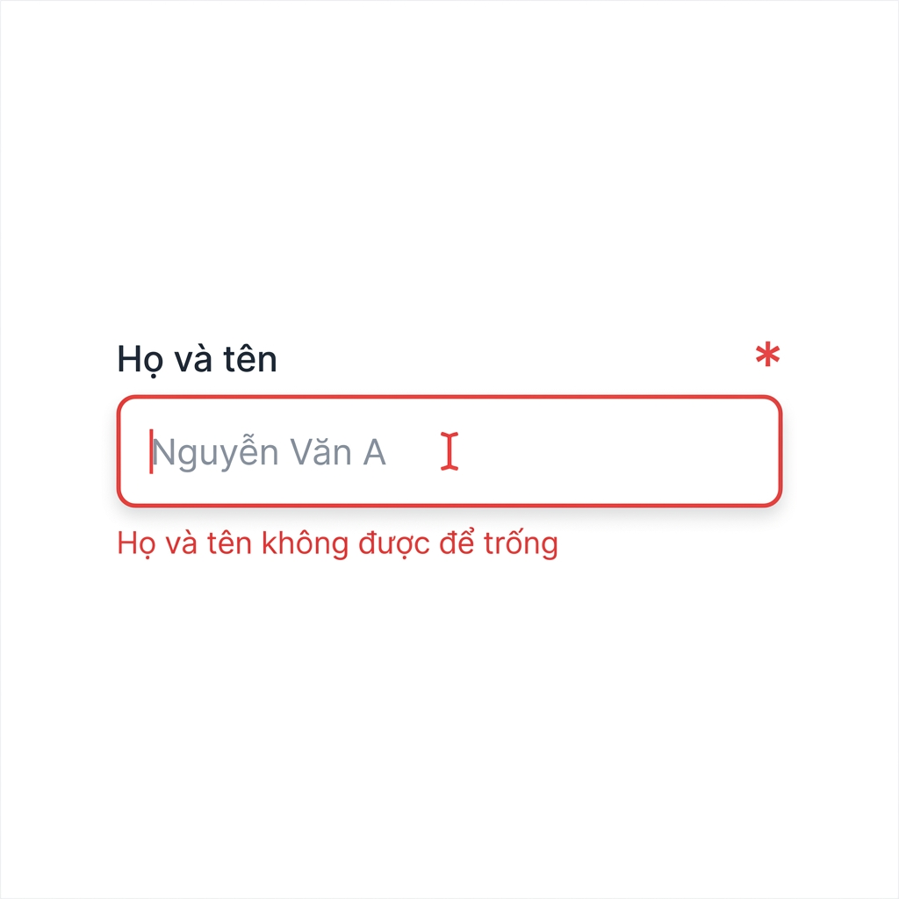

# Tài liệu Thống nhất Component Chung - Hệ thống DLDC

Tài liệu này quy định các tiêu chuẩn về giao diện (UI/UX) cho toàn bộ hệ thống DLDC, bao gồm font chữ, màu sắc, icon và các thành phần giao diện dùng chung nhằm đảm bảo tính nhất quán và trải nghiệm người dùng cao cấp.

> **Nguồn chuẩn (cập nhật 05/10/2026):** "Bộ quy chuẩn giao diện KDLDC-BTP" — lấy trang **Thiết lập thu thập** của hệ thống Bộ Tư pháp làm chuẩn (đo computed style). Khi tài liệu này và mã nguồn khác nhau, **lấy tài liệu này làm chuẩn**.
>
> **Quyết định đã chốt:**
> - Dùng **một màu xanh chính duy nhất `#155DFC`** (token `blue-600` của Tailwind v4 mà dự án đang dùng) cho nút chính, menu đang chọn, tab đang chọn, liên kết, focus. Không dùng `#155dfc`, `#135DFF`.
> - **Chữ dài trong bảng: cắt chữ (`…`) trên một dòng, hover hiển thị toàn bộ bằng tooltip** (mục 5.3.1).
>
> **Lưu ý Tailwind v4:** mã màu của token khác Tailwind v3 (VD `blue-600` = `#155DFC`, `slate-500` ≈ `#62748E`). Với các màu cần khớp chính xác mã hex ở bảng dưới, dùng giá trị tùy biến `[#...]` hoặc biến CSS ở mục 7.

---

## 1. Hệ thống Typography (Font & Chữ)

Hệ thống sử dụng bộ font **Inter** cho **mọi phần tử**. Cỡ chữ nền là **13px**, chữ phụ **12px**.

| Thành phần | Cỡ chữ (Size) | Trọng số (Weight) | Màu sắc | Ghi chú |
| :--- | :--- | :--- | :--- | :--- |
| **Tiêu đề chính (H1)** | 16px | Medium (500) | `#020817` | Tiêu đề trang / modal |
| **Tiêu đề phụ (H2)** | 14px | Medium (500) | `#020817` | Tiêu đề khối/section |
| **Tiêu đề nhỏ (H3)** | 13px | Medium (500) | `#020817` | Tiêu đề nhóm |
| **Văn bản nội dung (P)** | 13px | Regular (400) | `#020817` | Cỡ chữ mặc định |
| **Tên hệ thống (logo)** | 13px | Semibold (600) | `#020817` | Sidebar |
| **Dòng phụ dưới logo** | 12px | Regular (400) | `#64748B` | Sidebar |
| **Menu sidebar** | 12px | 400 (đang chọn: **500**) | `#020817` (đang chọn: **`#155DFC`**) | Mục 5.18 |
| **Breadcrumb** | 12px | Regular (400) | `#020817` | Mục 5.15 |
| **Tab nội dung** | 14px | Semibold (600) | Đang chọn `#155DFC`, thường `#64748B` | Mục 5.9 |
| **Nhãn thẻ thống kê** | 16px | Regular (400) | `#64748B` | Mục 5.6.1 |
| **Số thẻ thống kê** | 16px | Semibold (600) | `#0F172A` | Mục 5.6.1 |
| **Nút bấm** | 13px | Medium (500) | Theo loại nút | Mục 5.1 |
| **Tiêu đề cột bảng (`th`)** | 13px | **Bold (700)** | `#000000` | Mục 5.3 |
| **Ô bảng (`td`)** | 13px | Regular (400) | `#000000` | Mục 5.3 |
| **Badge** | 13px | Regular (400) | Theo loại badge | Mục 5.8 |
| **Nhãn (Label) form** | 13px | Medium (500) | `#020817` | Mục 5.2 |
| **Ô nhập liệu** | 13px | Regular (400) | `#020817` | Mục 5.2 |
| **Chú thích (Small)** | 12px | Regular (400) | `#64748B` | Mô tả nhỏ |
| **Liên kết (Link)** | 13px | Medium (500) | `#155DFC` | Hyperlink |

**Font Family:** `Inter, system-ui, sans-serif`

**Quy tắc bắt buộc:** `button`, `input`, `select`, `textarea` phải kế thừa font từ thẻ cha (`font-family: inherit`). Không để nút/ô nhập rơi về font mặc định của trình duyệt (VD Arial).

---

## 2. Hệ thống Màu sắc (Color System)

Màn hình mới **chỉ dùng các màu trong bảng dưới**, không dùng mã màu rời.

### 2.1. Màu theo vai trò

| Vai trò | Mã màu | Màu thực tế | Token Tailwind (v4) | Dùng cho |
| :--- | :--- | :---: | :--- | :--- |
| **Primary (xanh chính)** | `#155DFC` |  | `blue-600` | Nút chính, menu đang chọn, tab đang chọn, liên kết, focus |
| **Nền menu đang chọn** | `#EAF3FF` |  | `[#EAF3FF]` | Hàng menu đang chọn |
| **Chữ chính (Foreground)** | `#020817` |  | `[#020817]` | Menu, breadcrumb, input, nội dung |
| **Chữ đậm** | `#0F172A` |  | `[#0F172A]` | Số thống kê, tiêu đề |
| **Chữ nút viền** | `#334155` |  | `[#334155]` | Nút outline |
| **Chữ cấp cha / icon** | `#475569` |  | `[#475569]` | Hàng menu cha, icon chuông, icon nút trắng |
| **Chữ phụ (Muted)** | `#64748B` |  | `[#64748B]` | Nhãn thẻ, dòng phụ, tab thường |
| **Chữ bảng** | `#000000` |  | `black` | `th`, `td` |
| **Nền trắng** | `#FFFFFF` |  | `white` | Sidebar, header, thẻ, hàng bảng |
| **Nền nhạt** | `#F8FAFC` |  | `[#F8FAFC]` | Header bảng, badge Rỗng |
| **Viền** | `#E2E8F0` |  | `[#E2E8F0]` | Header, thẻ, nút icon, ô nhập |
| **Viền đậm** | `#CBD5E1` |  | `[#CBD5E1]` | Nút outline |
| **Đường kẻ hàng bảng** | `#E0E0E0` |  | `[#E0E0E0]` | Viền dưới mỗi hàng bảng |
| **Nút icon nhấn mạnh** | `#10B981` |  | `[#10B981]` | Nút icon nền xanh lá |

### 2.2. Màu trạng thái

| Tên màu | Mục đích sử dụng | Màu thực tế | Mã màu |
| :--- | :--- | :---: | :--- |
| **Destructive** | Nút xóa, lỗi |  | `#DC2626` |
| **Success** | Thông báo thành công |  | `#16A34A` |
| **Warning** | Lưu ý |  | `#CA8A04` |

> Màu nền trang (vùng ngoài nội dung) **chưa xác nhận** ở trang chuẩn.

---

## 3. Hệ thống Icon Chung (Lucide Icons)

Sử dụng thư viện **Lucide React** cho toàn bộ icon.

| Hành động | Biểu tượng | Tên Icon (Lucide) | Màu sắc gợi ý | Ghi chú |
| :--- | :---: | :--- | :--- | :--- |
| **Dữ liệu / Lớp** |  | `Layers` | `Blue` | Quản lý nguồn dữ liệu / Lớp bản đồ |
| **Làm mới / Test** |  | `RefreshCw` | `Slate` | Đồng bộ dữ liệu hoặc Test kết nối |
| **Thêm nhanh** |  | `Plus` | `Primary` | Thêm bản ghi hoặc thành phần mới |
| **Kích hoạt / Cấp quyền** |  | `Power` | `Orange` | Bật/Tắt trạng thái hoặc Cấu hình |
| **Xóa sạch / Reset** |  | `Eraser` | `Slate` | Xóa trắng dữ liệu nhập hoặc Reset |
| **Xem chi tiết** |  | `Eye` | `Slate` | Xem thông tin chi tiết (Read-only) |
| **Xóa bỏ** |  | `Trash2` | `Red` | Xóa vĩnh viễn bản ghi |

### Các hành động bổ sung (Cần thiết cho dự án)

Qua kiểm tra dự án, các hành động sau cũng xuất hiện thường xuyên và cần thống nhất:

| Hành động | Biểu tượng | Tên Icon (Lucide) | Màu sắc gợi ý | Ghi chú |
| :--- | :---: | :--- | :--- | :--- |
| **Chỉnh sửa** |  | `Edit2` / `Pencil` | `Indigo` | Thay đổi nội dung đã có |
| **Trình duyệt** |  | `Send` | `Indigo` | Mở giao diện trình duyệt dữ liệu |
| **Duyệt** |  | `CheckCircle` | `Success` | Phê duyệt hồ sơ / dữ liệu |
| **Từ chối duyệt** |  | `Ban` | `Destructive` | Từ chối phê duyệt hồ sơ |
| **Xuất Excel** |  | `FileSpreadsheet` | `Success` | Trích xuất dữ liệu ra định dạng .xlsx |
| **Xuất PDF** |  | `FileText` | `Destructive` | Trích xuất dữ liệu ra định dạng .pdf |
| **Tìm kiếm / Lọc** |  | `Search` | `Slate` | Tìm kiếm cơ bản |
| **Tìm kiếm nâng cao** |  | `Filter` | `Slate` | Lọc dữ liệu theo nhiều tiêu chí |
| **Tải về** |  | `Download` | `Primary` | Tải tài liệu đính kèm |
| **Lưu lại** |  | `Save` | `Primary` | Lưu các thay đổi trong form |


---

## 4. Hệ thống Nền tảng (Foundations)

### 4.1. Hệ thống Khoảng cách (Spacing System)
Quy định các bước nhảy khoảng cách (padding, margin, gap) theo bội số của 4 để đảm bảo UI không bị lộn xộn và có tính nhất quán cao.

- **4px (xs):** Dùng cho khoảng cách cực nhỏ.
- **8px (sm):** Dùng cho khoảng cách nhỏ.
- **12px (md):** Dùng cho padding nhỏ.
- **16px (lg):** Mặc định cho padding chung.
- **24px (xl):** Dùng cho khoảng cách lớn.
- **32px (2xl):** Dùng cho khoảng cách rất lớn.

**Ví dụ hiển thị:**
<div style="display: flex; gap: 16px; margin-top: 8px;">
  <div style="display: flex; flex-direction: column; gap: 8px; align-items: center;"><div style="width: 32px; height: 32px; background: #e2e8f0; padding: 4px;"><div style="width: 100%; height: 100%; background: #155dfc;"></div></div><span style="font-size: 12px;">4px</span></div>
  <div style="display: flex; flex-direction: column; gap: 8px; align-items: center;"><div style="width: 32px; height: 32px; background: #e2e8f0; padding: 8px;"><div style="width: 100%; height: 100%; background: #155dfc;"></div></div><span style="font-size: 12px;">8px</span></div>
  <div style="display: flex; flex-direction: column; gap: 8px; align-items: center;"><div style="width: 32px; height: 32px; background: #e2e8f0; padding: 12px;"><div style="width: 100%; height: 100%; background: #155dfc;"></div></div><span style="font-size: 12px;">12px</span></div>
</div>

### 4.2. Hệ thống Z-index (Z-index Scale)
Quy định để tránh lỗi đè component khi hệ thống phức tạp (VD: Dropdown bị che bởi Header).

| Thành phần | Giá trị Z-index | Ghi chú |
| :--- | :--- | :--- |
| **Base** | `0` | Các thành phần cơ bản trên trang |
| **Dropdown / Popover** | `10` | Menu thả xuống |
| **Sticky Header / Navbar** | `50` | Thanh điều hướng cố định |
| **Modal / Dialog / Drawer** | `100` | Hộp thoại nổi lên giữa màn hình |
| **Toast / Notification** | `200` | Thông báo |
| **Tooltip** | `300` | Ghi chú khi hover |

### 4.3. Bo góc (Border Radius)

| Mức | Giá trị | Class Tailwind | Dùng cho |
| :--- | :--- | :--- | :--- |
| **Nút / ô nhập** | 8px | `rounded-lg` | Nút bấm, nút icon, input, select, textarea |
| **Hàng menu** | 10px | `rounded-[10px]` | Hàng menu sidebar |
| **Thẻ / badge** | 16px | `rounded-2xl` (thẻ), `rounded-full` hoặc `rounded-2xl` (badge cao 26px) | Thẻ thống kê, badge |
| **Tab, header, sidebar, ô bảng** | 0 | — | — |

> Trong `src/index.css`, `--radius: .5rem` ⇒ `rounded-lg` = 8px, `rounded-xl` = 12px; `rounded-2xl` cố định 16px.

### 4.4. Khung trang (Layout)

| Khu vực | Quy chuẩn |
| :--- | :--- |
| **Sidebar** | Rộng **250px**, nền `#FFFFFF`. Logo trên cùng: tên hệ thống 13px/600 kèm dòng phụ 12px `#64748B` (mục 5.18) |
| **Header** | Cao **64px**, nền trắng, viền dưới 1px `#E2E8F0`. Bên phải có nút chuông 40×40 tròn kèm số đếm |
| **Breadcrumb** | 12px, dạng `Quản lý thu thập / Thiết lập thu thập` (mục 5.15) |
| **Tab** | Nằm trong vùng nội dung, dưới breadcrumb (mục 5.9) |
| **Thẻ thống kê** | Một hàng 4 thẻ (mục 5.6.1) |
| **Thanh công cụ** | Thứ tự: nút icon → **Thêm mới** → các nút viền (VD Tham số API, Giám sát) → **Kết xuất**. Khoảng cách giữa các nút 6–8px (`gap-2`) |
| **Bảng dữ liệu** | Dưới thanh công cụ, rộng hết vùng nội dung; bảng rộng hơn khung thì cuộn ngang (mục 5.3) |

---

## 5. Các Component Chung (Common Components)

Dưới đây là danh sách các component đã được xây dựng và cần tuân thủ thống nhất:

### 5.1. Nút bấm (Button)
Mọi nút: chữ **13px / Medium (500)**, bo góc **8px**, kế thừa font Inter. Nút chữ cao **40px**, padding 8×16; nút icon **40×40** (trong bảng **32×32**, icon 16px).

| Loại | Áp dụng | Bình thường | Hover | Đang chọn / đang mở | **Bị vô hiệu** |
| :--- | :--- | :--- | :--- | :--- | :--- |
| **Primary** | Thêm mới, Lưu / Xác nhận | Nền `#155DFC`, chữ trắng | Nền `#1447E6` | — | Nền `#F1F5F9`, chữ `#94A3B8` |
| **Outline** | Kết xuất, Tham số API, Giám sát, Hủy, Trước / Sau, số trang | Nền trắng, viền `#CBD5E1`, chữ `#334155` | Nền `#F8FAFC`, viền `#94A3B8`, chữ `#020817` | Trang hiện tại: nền + viền `#155DFC`, chữ trắng | Nền `#F1F5F9`, viền `#E2E8F0`, chữ `#94A3B8` |
| **Ghost** | Bỏ qua, thao tác phụ | Trong suốt, chữ `#020817` | Nền `#F1F5F9` | — | Chữ `#94A3B8` |
| **Destructive** | Xóa (modal xác nhận) | Nền `#DC2626`, chữ trắng | Nền `#B91C1C` | — | Nền `#F1F5F9`, chữ `#94A3B8` |
| **Icon nhấn mạnh** | Tìm kiếm | Nền `#10B981`, icon trắng | Nền `#059669` | — | Nền `#F1F5F9`, icon `#94A3B8` |
| **Icon outline** | Bộ lọc | Nền trắng, viền `#CBD5E1` ¹, icon `#475569` | Nền `#F8FAFC`, icon `#020817` | Nền `#EAF3FF`, viền `#BFDBFE`, icon `#155DFC` | Nền `#F1F5F9`, viền `#E2E8F0`, icon `#94A3B8` |
| **Icon trong bảng** (không viền, 32×32) | Xem chi tiết, Mapping, `⋯` | Trong suốt, icon `#475569` | Nền `#F1F5F9`, icon `#155DFC` | Menu `⋯` đang mở: nền `#EAF3FF`, icon `#155DFC` | Icon `#CBD5E1`, không hover, tooltip ghi lý do |
| **Chuông thông báo** | Header | Trong suốt, tròn, icon `#475569` | Nền `#F1F5F9` | — | — |

**Quy tắc trạng thái (bắt buộc):**
- **Nền xám `#F1F5F9` + chữ `#94A3B8` chỉ dành cho nút bị vô hiệu** — mọi loại nút dùng chung một kiểu, con trỏ `not-allowed`, không hover. **Không dùng `opacity-50`** (nút trắng làm mờ vẫn trông như nút bấm được).
- Nút bấm được luôn có chữ / icon đậm (`#334155`, `#475569` hoặc trắng trên nền màu) và luôn có phản hồi hover.
- Trạng thái đang chọn / đang mở dùng tông xanh (`#EAF3FF` / `#155DFC`) để không nhầm với vô hiệu.
- Focus bàn phím: viền 2px `#155DFC` (`focus-visible:ring-2`). Mỗi màn hình chỉ **một** nút Primary; "Thêm mới" đứng đầu nhóm nút hành động *(đề xuất)*.

¹ Trang chuẩn đo được viền `#E2E8F0`; tăng lên `#CBD5E1` để nút trên nền trắng dễ nhận ra.

**Class Tailwind chuẩn:**
```tsx
const DISABLED = 'disabled:bg-[#F1F5F9] disabled:border-[#E2E8F0] disabled:text-[#94A3B8] disabled:cursor-not-allowed disabled:hover:bg-[#F1F5F9]';
<button className={`h-10 px-4 rounded-lg bg-blue-600 text-white text-[13px] font-medium hover:bg-blue-700 ${DISABLED}`}>Thêm mới</button>
<button className={`h-10 px-4 rounded-lg border border-[#CBD5E1] bg-white text-[#334155] text-[13px] font-medium hover:bg-[#F8FAFC] hover:border-[#94A3B8] hover:text-[#020817] ${DISABLED}`}>Kết xuất</button>
<button className={`h-10 w-10 rounded-lg border border-[#CBD5E1] bg-white text-[#475569] hover:bg-[#F8FAFC] inline-flex items-center justify-center ${DISABLED}`}><Filter className="w-5 h-5" /></button>
```

**Ví dụ hiển thị (bấm được → bị vô hiệu):**
<div style="display: flex; gap: 8px; margin-top: 8px; flex-wrap: wrap; align-items: center;">
  <button style="background: #155dfc; color: white; height: 40px; padding: 8px 16px; border: none; border-radius: 8px; font-size: 13px; font-weight: 500;">Thêm mới</button>
  <button style="background: #f1f5f9; color: #94a3b8; height: 40px; padding: 8px 16px; border: none; border-radius: 8px; font-size: 13px; font-weight: 500; cursor: not-allowed;">Thêm mới</button>
  <button style="background: white; color: #334155; height: 40px; padding: 8px 16px; border: 1px solid #cbd5e1; border-radius: 8px; font-size: 13px; font-weight: 500;">Sau</button>
  <button style="background: #f1f5f9; color: #94a3b8; height: 40px; padding: 8px 16px; border: 1px solid #e2e8f0; border-radius: 8px; font-size: 13px; font-weight: 500; cursor: not-allowed;">Trước</button>
  <button style="background: #dc2626; color: white; height: 40px; padding: 8px 16px; border: none; border-radius: 8px; font-size: 13px; font-weight: 500;">Xóa</button>
  <button style="background: #10b981; color: white; width: 40px; height: 40px; border: none; border-radius: 8px;">⚲</button>
  <button style="background: white; color: #475569; width: 40px; height: 40px; border: 1px solid #cbd5e1; border-radius: 8px;">⛉</button>
  <button style="background: #eaf3ff; color: #155dfc; width: 40px; height: 40px; border: 1px solid #bfdbfe; border-radius: 8px;">⛉</button>
</div>

### 5.2. Ô nhập liệu (Input & Textarea)
- Chiều cao: **35px** (theo trang chuẩn). Padding **8×12**.
- Chữ: 13px / Regular (400) / `#020817`.
- Bo góc: **8px** — *đề xuất, chưa xác nhận từ trang chuẩn*.
- Viền: 1px `#E2E8F0` — *đề xuất, chưa xác nhận từ trang chuẩn*.
- Trạng thái Focus: ring 2px màu primary `#155DFC`.
- **Disabled (Vô hiệu hóa):** Nền xám nhạt (`bg-slate-100`), chữ mờ (`opacity-50`), con trỏ `not-allowed`.
- **Trường bắt buộc (Required):** Nhãn đi kèm dấu sao đỏ (`*`). Khi có lỗi (validation), border chuyển sang màu `destructive` (#dc2626) và hiển thị thông báo lỗi cỡ 12px bên dưới.
- **Cỡ chữ:** Nhãn và nội dung ô nhập đều 13px (theo bảng Typography mục 1).
- Placeholder, trạng thái lỗi/disabled **chưa đo** ở trang chuẩn — dùng quy định trên cho tới khi đo đủ.

**Class Tailwind chuẩn:**
```tsx
<label className="block text-[13px] font-medium text-[#020817] mb-1">
  Tên dịch vụ <span className="text-red-600">*</span>
</label>
<input className="w-full h-[35px] px-3 border border-[#E2E8F0] rounded-lg text-[13px] text-[#020817] bg-white
  focus:outline-none focus:ring-2 focus:ring-blue-600
  disabled:bg-slate-100 disabled:opacity-50 disabled:cursor-not-allowed" />
{/* Khi lỗi: thay border-[#E2E8F0] bằng border-red-600 và hiển thị: */}
<p className="mt-1 text-[12px] text-red-600">Tên dịch vụ không được để trống</p>
```
- Textarea dùng cùng class nhưng thay `h-[35px]` bằng `py-2` và đặt `rows`.
- Select dùng cùng class với input.

**Ví dụ hiển thị:**
<div style="margin-top: 8px; display: flex; gap: 16px; flex-wrap: wrap;">
  <div>
    <label style="display: block; font-size: 13px; font-weight: 500; margin-bottom: 4px; color: #020817;">Họ và tên</label>
    <input type="text" placeholder="Nhập họ và tên..." style="width: 100%; max-width: 350px; padding: 8px 12px; border: 1px solid #e2e8f0; border-radius: 8px; font-size: 13px; outline: none;" />
  </div>
  <div>
    <label style="display: block; font-size: 13px; font-weight: 500; margin-bottom: 4px; color: #64748b;">Mã định danh (Disabled)</label>
    <input type="text" value="ID_00123" disabled style="width: 100%; max-width: 350px; padding: 8px 12px; border: 1px solid #e2e8f0; border-radius: 8px; font-size: 13px; outline: none; background: #f1f5f9; color: #64748b; cursor: not-allowed; opacity: 0.8;" />
  </div>
  <div>
    <label style="display: block; font-size: 13px; font-weight: 500; margin-bottom: 4px; color: #dc2626;">Email <span style="color: #dc2626;">*</span></label>
    <input type="text" value="email-khong-hop-le" style="width: 100%; max-width: 350px; padding: 8px 12px; border: 1px solid #dc2626; border-radius: 8px; font-size: 13px; outline: none; background: #fef2f2;" />
    <span style="display: block; font-size: 12px; color: #dc2626; margin-top: 4px;">Email không đúng định dạng</span>
  </div>
</div>

**Minh họa trường bắt buộc và lỗi validation:**


### 5.3. Bảng dữ liệu (Table)

| Thành phần | Quy chuẩn |
| :--- | :--- |
| **Tiêu đề cột (`th`)** | Nền `#F8FAFC`, cao **42px**, padding **13×12**, chữ **13px / Bold (700) / `#000000`**, chữ thường (không `uppercase`). **Bắt buộc in đậm ở mọi bảng.** Sticky khi bảng dài |
| **Ô dữ liệu (`td`)** | Padding **4×12**, chữ 13px / Regular (400) / `#000000` |
| **Hàng (`tr`)** | Cao **48px** (mỗi ô một dòng), nền trắng, đường kẻ dưới 1px **`#E0E0E0`**, hover nền `#F8FAFC` |
| **Chữ dài** | **Cắt chữ trên 1 dòng + tooltip khi hover** (mục 5.3.1). Không để ô xuống nhiều dòng |
| **Độ rộng** | Rộng hết vùng nội dung; nếu tổng cột rộng hơn khung thì **cuộn ngang** |
| **Định dạng** | Phiên bản `v1.0.2`; ngày `dd/MM/yyyy`, giờ `HH:mm:ss` xuống dòng dưới (mục 5.3.3) |
| **Cột hành động** | Cuối cùng bên phải, căn giữa; tối đa 3 nút — quy tắc chi tiết ở mục 5.3.2 |
| **Căn lề** | Theo kiểu dữ liệu của cột — mục 5.3.3 |

> Bảng Thiết lập thu thập — thứ tự cột: STT; Tên dịch vụ; Mã dịch vụ; Loại nguồn; Phương thức kết nối; Phiên bản; Hệ thống nguồn; Ngày tạo; Trạng thái dịch vụ; Trạng thái dữ liệu; Thao tác.

**Class Tailwind chuẩn:**
```tsx
<thead className="bg-[#F8FAFC] sticky top-0 z-10">
  <tr>
    <th className="h-[42px] px-3 py-[13px] text-left text-[13px] font-bold text-black whitespace-nowrap">Tên dịch vụ</th>
  </tr>
</thead>
<tbody>
  <tr className="h-12 bg-white border-b border-[#E0E0E0] hover:bg-[#F8FAFC]">
    <td className="px-3 py-1 text-[13px] text-black">API Hộ tịch</td>
  </tr>
</tbody>
```

**Ví dụ hiển thị:**
<div style="margin-top: 8px; border: 1px solid #e2e8f0; border-radius: 8px; overflow: hidden; max-width: 560px;">
  <table style="width: 100%; border-collapse: collapse; text-align: left; font-size: 13px; color: #000;">
    <thead style="background: #f8fafc;">
      <tr style="height: 42px;"><th style="padding: 13px 12px; font-weight: 700;">STT</th><th style="padding: 13px 12px; font-weight: 700;">Tên dịch vụ</th><th style="padding: 13px 12px; font-weight: 700;">Trạng thái</th><th style="padding: 13px 12px; font-weight: 700; text-align: right;">Thao tác</th></tr>
    </thead>
    <tbody>
      <tr style="height: 48px; border-bottom: 1px solid #e0e0e0;"><td style="padding: 4px 12px;">1</td><td style="padding: 4px 12px; max-width: 220px; white-space: nowrap; overflow: hidden; text-overflow: ellipsis;" title="HTPLDNNVV_Thống kê kết quả triển khai công tác hỗ trợ pháp lý cho DNNVV tại cơ quan chuyên môn thuộc UBND cấp tỉnh">HTPLDNNVV_Thống kê kết quả triển khai công tác hỗ trợ pháp lý cho DNNVV tại cơ quan chuyên môn thuộc UBND cấp tỉnh</td><td style="padding: 4px 12px;"><span style="background: #f0fdf4; color: #15803d; border: 1px solid #dcfce7; padding: 2px 8px; border-radius: 16px; font-size: 13px;">Hoạt động</span></td><td style="padding: 4px 12px; text-align: right; color: #475569;">⋯</td></tr>
    </tbody>
  </table>
</div>

#### 5.3.1. Cắt chữ dài và Tooltip hiển thị đầy đủ
- Áp dụng cho mọi ô chứa chữ có thể dài (Tên dịch vụ, Hệ thống nguồn, Mô tả…).
- **Ô bảng:** hiển thị trên **1 dòng**, phần thừa cắt bằng dấu `…` (`truncate`), đặt `max-width` cho cột (VD Tên dịch vụ `max-w-[360px]`).
- **Khi hover:** hiện tooltip chứa **toàn bộ nội dung**, nằm **phía trên** ô, có mũi tên chỉ xuống ô.
- Chỉ hiện tooltip khi chữ thực sự bị cắt (khuyến nghị); không dùng thuộc tính `title` mặc định của trình duyệt vì không theo được kiểu dáng chuẩn.

| Thuộc tính tooltip | Giá trị |
| :--- | :--- |
| Nền | Xám đậm, hơi trong suốt — `rgba(71, 85, 105, 0.95)` (≈ `#475569`) |
| Chữ | 12px / Medium (500) / trắng, xuống dòng tự do |
| Padding / bo góc | 8×12 / 8px |
| Độ rộng tối đa | 480px |
| Vị trí / z-index | Phía trên ô, căn trái theo ô, mũi tên 6px / `z-[300]` (mục 4.2) |

> Thông số tooltip lấy theo ảnh mẫu được PM duyệt (05/10/2026), **chưa đo bằng DevTools**.

**Class Tailwind chuẩn** (dùng `Tooltip` của shadcn/radix có sẵn trong `src/components/ui/tooltip.tsx`):
```tsx
<td className="px-3 py-1 text-[13px] text-black max-w-[360px]">
  <Tooltip>
    <TooltipTrigger asChild>
      <span className="block truncate">{service.name}</span>
    </TooltipTrigger>
    <TooltipContent side="top" align="start"
      className="max-w-[480px] bg-[#475569]/95 text-white text-[12px] font-medium px-3 py-2 rounded-lg">
      {service.name}
    </TooltipContent>
  </Tooltip>
</td>
```

**Ví dụ hiển thị:**
<div style="margin-top: 8px; position: relative; padding-top: 52px; max-width: 520px; font-size: 13px;">
  <div style="position: absolute; top: 0; left: 12px; max-width: 480px; background: rgba(71,85,105,0.95); color: #fff; font-size: 12px; font-weight: 500; padding: 8px 12px; border-radius: 8px;">HTPLDNNVV_Thống kê kết quả triển khai công tác hỗ trợ pháp lý cho DNNVV tại cơ quan chuyên môn thuộc UBND cấp tỉnh</div>
  <div style="height: 48px; display: flex; align-items: center; border-bottom: 1px solid #e0e0e0; background: #f8fafc; padding: 4px 12px;"><span style="white-space: nowrap; overflow: hidden; text-overflow: ellipsis; max-width: 420px;">HTPLDNNVV_Thống kê kết quả triển khai công tác hỗ trợ pháp lý cho DNNVV tại cơ quan chuyên môn thuộc UBND cấp tỉnh</span></div>
</div>

#### 5.3.2. Cột thao tác (Action Column) — xử lý khi có nhiều nút

**Vị trí:** luôn là cột **cuối cùng** bên phải, tiêu đề "Thao tác", nội dung **căn giữa**. Bảng cuộn ngang thì cột này **cố định bên phải** (`sticky right-0 bg-white`).

**Hiển thị:** các nút thao tác (kể cả nút `⋯`) **luôn hiển thị** trên mọi hàng — **không ẩn chờ hover**. Lý do: hover không dùng được trên thiết bị cảm ứng và làm giảm khả năng người dùng phát hiện thao tác (theo NN/g, IBM Carbon).

**Quy tắc số lượng nút:**

| Số thao tác của một hàng | Cách hiển thị |
| :--- | :--- |
| **1 – 3** | Hiển thị **tất cả** dạng nút icon |
| **≥ 4** | Hiển thị **tối đa 2 nút icon** dùng nhiều nhất + **1 nút `⋯`** (`MoreVertical`) chứa các thao tác còn lại. Tổng cộng **không quá 3 nút** trên một hàng |

**Thứ tự ưu tiên khi chọn nút để ngoài** (từ trái sang phải):
1. **Xem chi tiết** (`Eye`) — luôn đứng đầu nếu có.
2. Thao tác nghiệp vụ dùng thường xuyên nhất của màn hình (VD: Sửa, Mapping chi tiết).
3. Các thao tác còn lại đưa vào menu `⋯`.

> **Không bao giờ để nút Xóa / thao tác không hoàn tác ra ngoài** khi có từ 4 thao tác trở lên — luôn đặt trong menu `⋯`.

**Nút icon trong bảng:**

| Thuộc tính | Giá trị |
| :--- | :--- |
| Kích thước | **32×32px** (vừa hàng cao 48px), icon **16px** (`w-4 h-4`) |
| Màu icon / hover / menu mở / vô hiệu | `#475569` / nền `#F1F5F9` icon `#155DFC` / nền `#EAF3FF` icon `#155DFC` / icon `#CBD5E1` (mục 5.1) |
| Bo góc | 8px (`rounded-lg`) |
| Khoảng cách giữa nút | 4px (`gap-1`) |
| Tooltip | **Bắt buộc**, ghi đúng tên thao tác (VD "Xem chi tiết"), kiểu tooltip mục 5.3.1 — không dùng `title` |

**Menu `⋯` (dropdown):**

| Thuộc tính | Giá trị |
| :--- | :--- |
| Khung | Rộng 224px (`w-56`), nền trắng, viền 1px `#E2E8F0`, bo 8px, bóng `shadow-lg`, mở căn **phải** (`align="end"`), z-index dropdown (mục 4.2) |
| Mục (item) | Cao 32px, padding 8×12, chữ **13px / 400 / `#020817`**, icon 16px `#475569` bên trái, cách chữ 8px |
| Nhóm | Khi ≥ 4 mục và thao tác thuộc **nhiều đối tượng** → chia nhóm theo đối tượng (VD "Dữ liệu", "Dịch vụ"). Nhãn nhóm 12px / 500 / `#64748B`, **không uppercase**; giữa các nhóm có đường phân cách 1px `#E2E8F0` |
| Thứ tự trong nhóm | Tạo / cập nhật → đổi trạng thái (Bật/Ngừng hoạt động) → **Xóa (cuối cùng)** |
| Mục nguy hiểm | Xóa / thao tác không hoàn tác: **chữ và icon `#DC2626`**, đặt cuối nhóm, **bắt buộc có modal xác nhận** (mục 5.4) |

**Thao tác không áp dụng theo trạng thái** (VD dịch vụ Bản nháp chưa thể "Cập nhật dữ liệu"):
- Nút icon bên ngoài: **giữ nguyên vị trí**, làm mờ (`opacity-50 cursor-not-allowed`), tooltip ghi lý do.
- Mục trong menu `⋯`: hiển thị dạng **disabled** (mờ 50%) để người dùng biết thao tác tồn tại; không ẩn để thứ tự menu không đổi giữa các hàng.
- **Mục disabled trong menu phải ghi lý do ngay trong mục** (không dùng tooltip trong menu — theo GitHub Primer): dòng phụ **12px / 400 / `#64748B`** nằm dưới tên mục, VD "Cần cấu hình kết nối trước". Mục có dòng lý do được phép cao hơn 32px.

```tsx
<DropdownMenuItem disabled className="px-3 py-1.5 gap-2 text-[13px] text-[#020817] items-start">
  <RefreshCw className="w-4 h-4 mt-0.5 text-[#475569]" />
  <div className="flex flex-col">
    <span>Cập nhật dữ liệu</span>
    <span className="text-[12px] text-[#64748B]">Cần cấu hình kết nối trước</span>
  </div>
</DropdownMenuItem>
```

**Áp dụng cho màn Thiết lập thu thập (6 thao tác):**

| Vị trí | Thao tác | Icon |
| :--- | :--- | :--- |
| Ngoài 1 | Xem chi tiết | `Eye` |
| Ngoài 2 | Mapping chi tiết | `Layers` |
| Menu `⋯` — nhóm **Dữ liệu** | Tích hợp mới · Cập nhật dữ liệu · **Xóa dữ liệu thu thập** (đỏ) | `Plus` · `RefreshCw` · `Eraser` |
| Menu `⋯` — nhóm **Dịch vụ** | Ngừng hoạt động · **Xóa dịch vụ** (đỏ) | `Power` · `Trash2` |

**Class Tailwind chuẩn:**
```tsx
<td className="px-3 py-1 text-center sticky right-0 bg-white">
  <div className="inline-flex items-center justify-center gap-1">
    <Tooltip>
      <TooltipTrigger asChild>
        <button className="w-8 h-8 inline-flex items-center justify-center rounded-lg text-[#475569] hover:bg-[#F1F5F9] hover:text-blue-600">
          <Eye className="w-4 h-4" />
        </button>
      </TooltipTrigger>
      <TooltipContent>Xem chi tiết</TooltipContent>
    </Tooltip>
    {/* ... nút icon thứ 2 ... */}
    <DropdownMenu>
      <DropdownMenuTrigger asChild>
        <button className="w-8 h-8 inline-flex items-center justify-center rounded-lg text-[#475569] hover:bg-[#F1F5F9] data-[state=open]:bg-[#EAF3FF] data-[state=open]:text-blue-600">
          <MoreVertical className="w-4 h-4" />
        </button>
      </DropdownMenuTrigger>
      <DropdownMenuContent align="end" className="w-56 rounded-lg border border-[#E2E8F0] bg-white shadow-lg">
        <DropdownMenuLabel className="px-3 py-1 text-[12px] font-medium text-[#64748B]">Dữ liệu</DropdownMenuLabel>
        <DropdownMenuItem className="h-8 px-3 gap-2 text-[13px] text-[#020817]">
          <RefreshCw className="w-4 h-4 text-[#475569]" /> Cập nhật dữ liệu
        </DropdownMenuItem>
        <DropdownMenuItem className="h-8 px-3 gap-2 text-[13px] text-[#DC2626] focus:text-[#DC2626]">
          <Eraser className="w-4 h-4 text-[#DC2626]" /> Xóa dữ liệu thu thập
        </DropdownMenuItem>
        <DropdownMenuSeparator className="bg-[#E2E8F0]" />
        {/* nhóm Dịch vụ ... */}
      </DropdownMenuContent>
    </DropdownMenu>
  </div>
</td>
```

**Ví dụ hiển thị:**
<div style="margin-top: 8px; display: flex; gap: 24px; align-items: flex-start; font-size: 13px;">
  <div style="display: inline-flex; gap: 4px; padding: 8px 12px; border: 1px solid #e2e8f0; border-radius: 8px; background: white;">
    <span style="width: 32px; height: 32px; display: inline-flex; align-items: center; justify-content: center; border-radius: 8px; color: #475569;">👁</span>
    <span style="width: 32px; height: 32px; display: inline-flex; align-items: center; justify-content: center; border-radius: 8px; color: #475569;">☰</span>
    <span style="width: 32px; height: 32px; display: inline-flex; align-items: center; justify-content: center; border-radius: 8px; color: #475569; background: #f8fafc;">⋮</span>
  </div>
  <div style="width: 224px; border: 1px solid #e2e8f0; border-radius: 8px; background: white; box-shadow: 0 10px 15px -3px rgba(0,0,0,0.1); padding: 4px 0;">
    <div style="padding: 4px 12px; font-size: 12px; font-weight: 500; color: #64748b;">Dữ liệu</div>
    <div style="height: 32px; display: flex; align-items: center; gap: 8px; padding: 0 12px; color: #020817;">＋ Tích hợp mới</div>
    <div style="height: 32px; display: flex; align-items: center; gap: 8px; padding: 0 12px; color: #020817;">⟳ Cập nhật dữ liệu</div>
    <div style="height: 32px; display: flex; align-items: center; gap: 8px; padding: 0 12px; color: #dc2626;">⌫ Xóa dữ liệu thu thập</div>
    <div style="height: 1px; background: #e2e8f0; margin: 4px 0;"></div>
    <div style="padding: 4px 12px; font-size: 12px; font-weight: 500; color: #64748b;">Dịch vụ</div>
    <div style="height: 32px; display: flex; align-items: center; gap: 8px; padding: 0 12px; color: #020817;">⏻ Ngừng hoạt động</div>
    <div style="height: 32px; display: flex; align-items: center; gap: 8px; padding: 0 12px; color: #dc2626;">🗑 Xóa dịch vụ</div>
  </div>
</div>

> Màu icon trong bảng thống nhất `#475569` (theo nút icon nền trắng ở mục 5.1); các màu gợi ý theo hành động ở mục 3 chỉ áp dụng ngoài bảng (thanh công cụ, form). Ngoại lệ: thao tác nguy hiểm luôn đỏ `#DC2626`.

#### 5.3.3. Căn lề cột
**Nguyên tắc:** căn lề khai báo **theo kiểu dữ liệu của cột** (không đặt riêng từng cột); **tiêu đề cột căn giống dữ liệu** của cột đó.

| Kiểu cột | Căn dữ liệu & tiêu đề | Ghi chú |
| :--- | :--- | :--- |
| STT | Giữa | Cột hẹp, độ rộng cố định |
| Văn bản (mã, tên, đơn vị, hệ thống nguồn, người, nội dung) | Trái | Cắt `…` + tooltip (mục 5.3.1) |
| Số lượng, số đếm, phần trăm, số tiền | **Phải**, `tabular-nums` | Cùng số chữ số thập phân trong cột; đơn vị ghi ở tiêu đề (VD "Dung lượng (GB)") |
| Ngày, giờ | Trái | Có cả ngày và giờ (`dd/MM/yyyy HH:mm:ss`) → **giờ xuống dòng thứ 2**; chỉ có ngày → 1 dòng |
| Phiên bản (v1.0.2), mã danh mục | Trái | Dữ liệu định danh |
| Badge (trạng thái, loại nguồn, phương thức kết nối) | **Trái** | Badge dài ngắn khác nhau — căn trái để thẳng một mép, dễ quét dọc (PM chốt 05/10/2026) |
| Thao tác (icon, nút) | Giữa | Mục 5.3.2 |
| Checkbox chọn dòng | Giữa | — |

**Quy tắc kèm theo:**
- Mỗi ô hiển thị **một dòng** (hàng cao 48px); văn bản dài cắt `…` và hiện đầy đủ trong tooltip, không tràn sang cột bên cạnh. **Ngoại lệ:** ô ngày giờ có cả ngày và giờ hiển thị 2 dòng (vẫn trong 48px).
- Giá trị trống `-` căn theo kiểu cột.
- Cột số, ngày, badge, thao tác, STT: rộng vừa nội dung, không xuống dòng (`whitespace-nowrap`); cột văn bản nhận phần rộng còn lại, có `max-width`.
- Tiêu đề gộp nhiều cột được căn giữa; dòng tổng cộng căn theo cột tương ứng.

```tsx
const ALIGN = { stt: 'text-center', text: 'text-left', number: 'text-right tabular-nums', date: 'text-left',
  id: 'text-left', badge: 'text-left', action: 'text-center', select: 'text-center' };
<th className={`... ${ALIGN[col.type]}`}>…</th>
<td className={`... ${ALIGN[col.type]}`}>…</td>
```

### 5.4. Hộp thoại (Dialog / Modal)
- Backdrop mặc định: Làm mờ nền 50% (`bg-black/50`).
- Tiêu đề: Luôn nằm ở phía trên bên trái.
- Nút đóng: Icon `X` ở góc trên bên phải.
- **Khi có Modal chồng nhau (Nested Modals):** Modal mở sau bắt buộc phải sinh ra một lớp Backdrop mới đè lên Modal trước đó, giữ nguyên độ mờ 50% để tạo chiều sâu và tập trung vào Modal hiện tại. Tuyệt đối không để vô tình đóng Modal 1 khi click ra ngoài Modal 2.

**Ví dụ hiển thị:**
<div style="margin-top: 8px; position: relative; height: 250px; background: #f8fafc; border: 1px solid #e2e8f0; border-radius: 8px; overflow: hidden; display: flex; align-items: center; justify-content: center;">
  <div style="position: absolute; inset: 0; background: rgba(0,0,0,0.2);"></div>
  <div style="position: absolute; top: 20px; left: 50%; transform: translateX(-50%); background: white; width: 300px; height: 150px; border-radius: 8px; box-shadow: 0 4px 6px -1px rgba(0,0,0,0.1); opacity: 0.8; padding: 16px;">
    <h3 style="margin: 0 0 8px 0; font-size: 14px;">Modal 1 (Bị mờ đi)</h3>
  </div>
  <div style="position: absolute; inset: 0; background: rgba(0,0,0,0.3);"></div>
  <div style="position: absolute; top: 60px; left: 50%; transform: translateX(-50%); background: white; width: 250px; padding: 16px; border-radius: 8px; box-shadow: 0 10px 15px -3px rgba(0,0,0,0.2); z-index: 10;">
    <h3 style="margin: 0 0 8px 0; font-size: 14px; font-weight: 600; color: #020817;">Modal 2 (Active)</h3>
    <p style="margin: 0; font-size: 12px; color: #475569;">Đang được tập trung vào với nền backdrop riêng.</p>
  </div>
</div>

### 5.5. Thông báo (Toast / Sonner)
- Vị trí: Góc dưới bên phải hoặc trên cùng giữa.
- Màu sắc: Tương ứng với trạng thái (Success, Error, Warning).

**Ví dụ hiển thị:**
<div style="margin-top: 8px; display: flex; align-items: center; gap: 12px; padding: 12px 16px; background: white; border: 1px solid #e2e8f0; border-radius: 8px; box-shadow: 0 4px 6px -1px rgba(0,0,0,0.1); width: fit-content;">
  <span style="color: #16a34a; font-size: 18px;">✅</span>
  <div>
    <p style="margin: 0; font-size: 14px; font-weight: 500; color: #020817;">Thành công!</p>
    <p style="margin: 0; font-size: 12px; color: #64748b;">Dữ liệu đã được lưu vào hệ thống.</p>
  </div>
</div>

### 5.6. Thẻ thông báo (Card)
- Dùng để gom nhóm thông tin, form hoặc hiển thị các chỉ số thống kê (Dashboard).
- Giao diện mặc định: Nền trắng, bo góc **16px** (`rounded-2xl`), viền 1px `#E2E8F0`, padding 16px.

**Ví dụ hiển thị:**
<div style="margin-top: 8px; padding: 16px; background: white; border: 1px solid #e2e8f0; border-radius: 16px; max-width: 300px;">
  <h3 style="margin: 0 0 4px 0; font-size: 16px; font-weight: 400; color: #64748b;">Tổng số Dữ liệu</h3>
  <p style="margin: 0; font-size: 16px; font-weight: 600; color: #0f172a;">1,245</p>
  <p style="margin: 4px 0 0 0; font-size: 12px; color: #16a34a;">+12% so với tháng trước</p>
</div>

#### 5.6.1. Thẻ thống kê (Stat Card)
- Dùng cho hàng thẻ tóm tắt số liệu ở đầu trang/modal (VD: Tổng số dịch vụ đã thiết lập, Đang hoạt động, Bản nháp, Ngưng hoạt động).

| Thuộc tính | Giá trị |
| :--- | :--- |
| Kích thước tham khảo | 224 × 106px (đo ở cửa sổ 847px — co giãn theo lưới) |
| Nền / viền | `#FFFFFF` / 1px `#E2E8F0` |
| Bo góc / padding | **16px** (`rounded-2xl`) / 16px (`p-4`) |
| Nhãn | **16px**, Regular (400), `#64748B` |
| Số liệu | **16px**, Semibold (600), `#0F172A` |
| Dòng xu hướng (nếu có) | 12px, màu Success/Destructive |
| Ô icon (nếu có) | Bên trái, `p-2 rounded-lg`, nền `{màu}-50`, icon `w-5 h-5` `{màu}-600`. Tổng → blue · Hoạt động → green · Nháp → yellow · Ngưng → slate · Lỗi → red |
| Bố cục hàng thẻ | `grid grid-cols-4 gap-4` |

**Class Tailwind chuẩn:**
```tsx
<div className="bg-white rounded-2xl border border-[#E2E8F0] p-4">
  <div className="flex items-center gap-3">
    <div className="p-2 rounded-lg bg-blue-50">
      <FileText className="w-5 h-5 text-blue-600" />
    </div>
    <div>
      <div className="text-[16px] text-[#64748B]">Tổng số dịch vụ đã thiết lập</div>
      <div className="text-[16px] font-semibold text-[#0F172A]">36</div>
    </div>
  </div>
</div>
```

### 5.7. Chọn giá trị (Select / Dropdown)
- Dùng cho các bộ lọc tìm kiếm hoặc form nhập liệu có danh sách cố định.
- Hiển thị icon chevron ở góc phải để nhận diện dễ dàng.

**Ví dụ hiển thị:**
<div style="margin-top: 8px;">
  <div style="display: flex; justify-content: space-between; align-items: center; width: 100%; max-width: 250px; padding: 8px 12px; border: 1px solid #e2e8f0; border-radius: 8px; font-size: 13px; background: white; color: #020817; cursor: pointer;">
    <span>Chọn phòng ban...</span>
    <span style="color: #64748b; font-size: 10px;">▼</span>
  </div>
</div>

### 5.8. Nhãn trạng thái (Badge)
- **Mọi badge dùng chung một khung:** chữ **13px / Regular (400)**, padding **2×8**, **viền 1px**, bo góc **16px**, cao **26px**. Chỉ đổi bộ ba màu chữ / nền / viền.

| Cột | Badge | Màu chữ | Màu nền | Màu viền |
| :--- | :--- | :--- | :--- | :--- |
| Loại nguồn | Trong ngành | `#8200DB` | `#FAF5FF` | `#E7E1EC` |
| Loại nguồn | Ngoài ngành | `#2563EB` ¹ | `#EFF6FF` | `#BFDBFE` |
| Phương thức kết nối | Cơ Sở Dữ Liệu | `#4338CA` | `#EEF2FF` | `#E0E7FF` |
| Phương thức kết nối | File | `#475569` | `#F8FAFC` | `#E2E8F0` |
| Phương thức kết nối | API | `#047857` | `#ECFDF5` | `#D1FAE5` |
| Phương thức kết nối | API nhận (JSON) / API nhận (XML) | `#C2410C` | `#FFF7ED` | `#FED7AA` |
| Trạng thái dịch vụ | Hoạt động | `#15803D` | `#F0FDF4` | `#DCFCE7` |
| Trạng thái dịch vụ | Bản nháp / Ngưng hoạt động | `#64748B` | `#F8FAFC` | `#E2E8F0` |
| Trạng thái dữ liệu | Rỗng | `#64748B` | `#F8FAFC` | `#E2E8F0` |
| Trạng thái dữ liệu | Lỗi cập nhật | `#B91C1C` | `#FEF2F2` | `#FEE2E2` |
| Trạng thái dữ liệu | Cập nhật thành công | `#047857` | `#ECFDF5` | `#D1FAE5` |
| Trạng thái dữ liệu | Đang xử lý | `#D97706` ² | `#FFFFFF` | `#F6B657` ² |

¹ Màu trạng thái do PM cung cấp (ảnh mẫu 05/10/2026). Badge "Ngoài ngành" dùng `#2563EB` theo ảnh mẫu — khác màu xanh chính `#155DFC` của nút/menu/tab.
² Đo từ ảnh mẫu (chữ bị khử răng cưa) — quy về giá trị gần nhất, cần xác nhận lại bằng DevTools.

**Class Tailwind chuẩn:**
```tsx
<span className="inline-flex items-center h-[26px] px-2 py-0.5 rounded-2xl border text-[13px] font-normal
  text-[#15803D] bg-[#F0FDF4] border-[#DCFCE7]">Hoạt động</span>
```

**Ví dụ hiển thị:**
<div style="display: flex; gap: 8px; margin-top: 8px; flex-wrap: wrap;">
  <span style="background: #faf5ff; color: #8200db; border: 1px solid #e7e1ec; padding: 2px 8px; border-radius: 16px; font-size: 13px;">Trong ngành</span>
  <span style="background: #eff6ff; color: #2563eb; border: 1px solid #bfdbfe; padding: 2px 8px; border-radius: 16px; font-size: 13px;">Ngoài ngành</span>
  <span style="background: #f0fdf4; color: #15803d; border: 1px solid #dcfce7; padding: 2px 8px; border-radius: 16px; font-size: 13px;">Hoạt động</span>
  <span style="background: #ecfdf5; color: #047857; border: 1px solid #d1fae5; padding: 2px 8px; border-radius: 16px; font-size: 13px;">Cập nhật thành công</span>
  <span style="background: #f8fafc; color: #64748b; border: 1px solid #e2e8f0; padding: 2px 8px; border-radius: 16px; font-size: 13px;">Rỗng</span>
</div>

### 5.9. Thẻ chuyển hướng (Tabs)
- Dùng để tổ chức và chuyển đổi nội dung trên cùng một màn hình (VD: Thiết lập dịch vụ / Quản lý nhật ký).
- Nằm **trong vùng nội dung**, dưới breadcrumb.

| Loại | Kích thước | Chữ | Nền | Gạch dưới | Bo |
| :--- | :--- | :--- | :--- | :--- | :--- |
| **Tab đang chọn** | cao **48px**, padding **12×16** | **14px / 600 / `#155DFC`** | trong suốt | 2px `#155DFC` — *chưa xác nhận ở trang chuẩn* | 0 |
| **Tab thường** | cao 48px, padding 12×16 | 14px / 600 / `#64748B` | trong suốt | không | 0 |

**Class Tailwind chuẩn:**
```tsx
<button className={`h-12 px-4 py-3 text-[14px] font-semibold border-b-2 transition-colors ${
  active ? 'text-blue-600 border-blue-600' : 'text-[#64748B] border-transparent hover:text-[#020817]'}`}>
  Thiết lập dịch vụ
</button>
```

**Ví dụ hiển thị:**
<div style="margin-top: 8px; display: flex; border-bottom: 1px solid #e2e8f0;">
  <div style="height: 48px; box-sizing: border-box; padding: 12px 16px; font-size: 14px; font-weight: 600; color: #155dfc; border-bottom: 2px solid #155dfc; cursor: pointer;">Thiết lập dịch vụ</div>
  <div style="height: 48px; box-sizing: border-box; padding: 12px 16px; font-size: 14px; font-weight: 600; color: #64748b; cursor: pointer;">Quản lý nhật ký</div>
</div>

### 5.10. Lọc theo khoảng thời gian (Date Range Picker)
- Dùng để chọn **Ngày bắt đầu** và **Ngày kết thúc** trong cùng một ô nhập liệu duy nhất.
- Định dạng hiển thị: `DD/MM/YYYY - DD/MM/YYYY`.
- Có icon lịch (`Calendar`) để kích hoạt bảng chọn ngày đôi.

**Ví dụ hiển thị:**
<div style="margin-top: 8px; display: flex; gap: 8px; align-items: center;">
  <div style="position: relative; width: 100%; max-width: 280px;">
    <input type="text" value="01/05/2024 - 12/05/2024" style="width: 100%; padding: 8px 36px 8px 12px; border: 1px solid #155dfc; border-radius: 8px; font-size: 13px; outline: none; background: white;" />
    <span style="position: absolute; right: 12px; top: 50%; transform: translateY(-50%); color: #64748b;">📅</span>
  </div>
</div>

### 5.11. Tìm kiếm thông minh (Combobox)
- Dùng cho các danh sách lớn, cho phép người dùng vừa nhập vừa tìm kiếm.
- Quy định: Chỉ hiển thị tối đa **5 kết quả khớp nhất** để đảm bảo gọn gàng.

**Ví dụ hiển thị:**
<div style="margin-top: 8px; width: 100%; max-width: 250px;">
  <input type="text" value="Hà N" style="width: 100%; padding: 8px 12px; border: 1px solid #155dfc; border-radius: 8px 8px 0 0; font-size: 13px; outline: none;" />
  <div style="border: 1px solid #e2e8f0; border-top: none; border-radius: 0 0 8px 8px; background: white; box-shadow: 0 4px 6px -1px rgba(0,0,0,0.1);">
    <div style="padding: 8px 12px; font-size: 13px; background: #eff6ff; color: #155dfc; cursor: pointer;">Hà <b>N</b>ội</div>
    <div style="padding: 8px 12px; font-size: 13px; color: #020817; cursor: pointer;">Hà <b>N</b>am</div>
    <div style="padding: 8px 12px; font-size: 13px; color: #020817; cursor: pointer;">Hà <b>N</b>ĩnh</div>
    <div style="padding: 8px 12px; border-top: 1px solid #f1f5f9; font-size: 12px; color: #94a3b8; text-align: center;">Hiển thị 3 / 3 kết quả</div>
  </div>
</div>

---

### 5.12. Checkbox, Radio Button & Toggle / Switch
- **Checkbox & Radio Button:** Dùng để chọn một hoặc nhiều. Có màu khi `checked` (thường là màu `primary`) và xám mờ khi `disabled`.
- **Toggle / Switch:** Dùng cho thao tác Bật/Tắt trạng thái hoặc cấp quyền. Thay thế cho Checkbox ở các cấu hình mang tính tức thời.

**Ví dụ hiển thị:**
<div style="margin-top: 8px; display: flex; gap: 24px; align-items: center;">
  <div style="display: flex; align-items: center; gap: 8px;">
    <div style="width: 16px; height: 16px; border-radius: 4px; background: #155dfc; display: flex; align-items: center; justify-content: center; color: white; font-size: 12px;">✓</div>
    <span style="font-size: 13px;">Đã chọn</span>
  </div>
  <div style="display: flex; align-items: center; gap: 8px;">
    <div style="width: 16px; height: 16px; border-radius: 50%; border: 4px solid #155dfc; background: white;"></div>
    <span style="font-size: 13px;">Radio chọn</span>
  </div>
  <div style="display: flex; align-items: center; gap: 8px;">
    <div style="width: 36px; height: 20px; border-radius: 20px; background: #155dfc; position: relative;">
      <div style="width: 16px; height: 16px; border-radius: 50%; background: white; position: absolute; right: 2px; top: 2px;"></div>
    </div>
    <span style="font-size: 13px;">Bật (Toggle)</span>
  </div>
</div>

### 5.13. Tải lên tệp (File Upload / Dropzone)
- Khu vực kéo thả tài liệu (VD: Import Excel/PDF).
- Giao diện có nét đứt (`border-dashed`), hiển thị icon tải lên ở giữa. Khi có tệp sẽ hiển thị tên tệp và icon Xóa.

**Ví dụ hiển thị:**
<div style="margin-top: 8px; border: 2px dashed #cbd5e1; border-radius: 8px; padding: 24px; text-align: center; background: #f8fafc; max-width: 400px;">
  <div style="font-size: 24px; color: #64748b; margin-bottom: 8px;">☁️</div>
  <p style="margin: 0; font-size: 13px; font-weight: 500; color: #020817;">Kéo thả file vào đây hoặc <span style="color: #155dfc; cursor: pointer;">Tải lên</span></p>
  <p style="margin: 4px 0 0 0; font-size: 12px; color: #64748b;">Hỗ trợ: .xlsx, .pdf (Tối đa 10MB)</p>
</div>

### 5.14. Phân trang (Pagination)
- Nằm ở dưới cùng của Bảng dữ liệu.
- Cung cấp tính năng chọn trang, xem tổng số bản ghi và điều chỉnh số dòng hiển thị trên mỗi trang (10 / 20 / 50 / 100; đổi số dòng thì quay về trang 1).
- Nút Trước / Sau / số trang dùng kiểu **Outline**; trang hiện tại kiểu đang chọn; Trước (trang đầu) và Sau (trang cuối) dùng trạng thái **bị vô hiệu** — theo bảng mục 5.1.

**Ví dụ hiển thị:**
<div style="margin-top: 8px; display: flex; align-items: center; justify-content: space-between; font-size: 13px; max-width: 600px; flex-wrap: wrap; gap: 12px;">
  <div style="display: flex; align-items: center; gap: 8px;">
    <span style="color: #64748b;">Hiển thị</span>
    <div style="padding: 4px 8px; border: 1px solid #e2e8f0; border-radius: 4px; background: white; display: flex; align-items: center; gap: 4px; cursor: pointer;">
      <span>10</span>
      <span style="font-size: 10px; color: #64748b;">▼</span>
    </div>
    <span style="color: #64748b;">bản ghi / trang</span>
  </div>
  
  <div style="display: flex; align-items: center; gap: 12px;">
    <span style="color: #64748b;">1 - 10 / 50</span>
    <div style="display: flex; gap: 4px;">
      <div style="padding: 4px 12px; border: 1px solid #e2e8f0; border-radius: 8px; background: #f1f5f9; color: #94a3b8; cursor: not-allowed;">Trước</div>
      <div style="padding: 4px 12px; border: 1px solid #155dfc; background: #155dfc; color: white; border-radius: 8px; cursor: pointer;">1</div>
      <div style="padding: 4px 12px; border: 1px solid #cbd5e1; border-radius: 8px; color: #334155; cursor: pointer;">2</div>
      <div style="padding: 4px 12px; border: 1px solid #cbd5e1; border-radius: 8px; color: #334155; cursor: pointer;">Sau</div>
    </div>
  </div>
</div>

### 5.15. Đường dẫn (Breadcrumb)
- Giúp người dùng biết mình đang ở đâu trong hệ thống.
- Cấu trúc: `Quản lý thu thập / Thiết lập thu thập`, phân cách bằng `/`.
- Toàn bộ breadcrumb: **12px / Regular (400) / `#020817`**. Các mục trước click được (hover gạch chân hoặc đổi màu `#155DFC`), mục hiện tại không click được.

**Class Tailwind chuẩn:**
```tsx
<nav className="flex items-center gap-2 text-[12px] text-[#020817]">
  <button className="hover:text-blue-600">Quản lý thu thập</button>
  <span>/</span>
  <span>Thiết lập thu thập</span>
</nav>
```

**Ví dụ hiển thị:**
<div style="margin-top: 8px; font-size: 12px; display: flex; gap: 8px; color: #020817;">
  <span style="cursor: pointer;">Quản lý thu thập</span>
  <span>/</span>
  <span>Thiết lập thu thập</span>
</div>

### 5.16. Trạng thái (Empty / Loading / Tooltip / Validation)
- **Trạng thái Rỗng (Empty State):** Bảng/danh sách không có dữ liệu. Hiển thị Icon to + Chữ mờ + Nút "Thêm mới".
- **Trạng thái Tải (Loading / Skeleton):** Spinner xoay hoặc khung xám nhấp nháy (skeleton) trong lúc chờ API.
- **Tooltip:** Hiển thị thông tin giải thích khi hover vào icon button (VD: Icon Trash hiện chữ "Xóa bản ghi"), hoặc hiển thị toàn bộ chữ bị cắt. Kiểu dáng thống nhất theo mục 5.3.1.
- **Thông báo Lỗi Input (Validation Form):** Dòng chữ báo lỗi màu đỏ nằm ngay dưới ô Input, viền ô Input cũng chuyển sang đỏ.

**Ví dụ hiển thị (Empty State & Validation):**
<div style="display: flex; gap: 24px; margin-top: 8px; flex-wrap: wrap;">
  <div style="border: 1px dashed #cbd5e1; padding: 24px; text-align: center; border-radius: 8px; background: #f8fafc; flex: 1; min-width: 200px;">
    <div style="font-size: 24px; color: #94a3b8; margin-bottom: 8px;">📂</div>
    <p style="margin: 0; font-size: 13px; font-weight: 500;">Không có dữ liệu</p>
    <button style="margin-top: 8px; background: white; border: 1px solid #e2e8f0; padding: 6px 12px; border-radius: 8px; font-size: 12px; color: #020817; cursor: pointer;">+ Thêm mới</button>
  </div>
  <div style="flex: 1; min-width: 200px;">
    <label style="display: block; font-size: 13px; font-weight: 500; margin-bottom: 4px; color: #dc2626;">Mã dữ liệu *</label>
    <input type="text" value="" style="width: 100%; padding: 8px 12px; border: 1px solid #dc2626; border-radius: 8px; font-size: 13px; outline: none; background: #fef2f2;" />
    <span style="display: block; font-size: 12px; color: #dc2626; margin-top: 4px;">Mã dữ liệu không được để trống</span>
  </div>
</div>

### 5.17. Trường thông tin chỉ đọc (Label – Value)
- Dùng cho màn hình **Xem chi tiết** (modal/trang read-only) hiển thị cặp Nhãn – Giá trị.
- **Nhãn:** 13px, Medium (500), màu `muted` (`#64748b` — `text-slate-500`). Viết hoa chữ đầu như form, **không dùng** `uppercase`.
- **Giá trị:** 13px, Regular (400), màu `foreground` (`text-slate-900`). **Không dùng** in nghiêng (`italic`) hay in đậm.
- **Giá trị trống:** Hiển thị dấu `-`.
- Khoảng cách nhãn – giá trị: 4px (`space-y-1`). Bố cục lưới 2 cột: `grid grid-cols-2 gap-x-6 gap-y-4`; trường dài (Mô tả, Ghi chú) chiếm 2 cột (`col-span-2`).
- Giá trị dạng trạng thái dùng Badge (mục 5.8); giá trị dạng liên kết dùng màu `primary`.
- Nhãn ở màn Xem chi tiết dùng **cùng cỡ chữ và độ đậm** với nhãn ở form Thêm mới/Chỉnh sửa (mục 5.2), chỉ khác màu (muted thay cho foreground) để người dùng phân biệt chế độ chỉ đọc.

**Class Tailwind chuẩn:**
```tsx
<div className="grid grid-cols-2 gap-x-6 gap-y-4">
  <div className="space-y-1">
    <div className="text-[13px] font-medium text-slate-500">Tên dịch vụ</div>
    <div className="text-[13px] text-slate-900 break-words">{value || '-'}</div>
  </div>
  <div className="space-y-1 col-span-2">
    <div className="text-[13px] font-medium text-slate-500">Mô tả</div>
    <div className="text-[13px] text-slate-900 whitespace-pre-line">{description || '-'}</div>
  </div>
</div>
```

**Ví dụ hiển thị:**
<div style="margin-top: 8px; display: grid; grid-template-columns: 1fr 1fr; gap: 16px 24px; max-width: 500px; padding: 16px; border: 1px solid #e2e8f0; border-radius: 8px; background: white;">
  <div><div style="font-size: 13px; font-weight: 500; color: #64748b; margin-bottom: 4px;">Tên dịch vụ</div><div style="font-size: 13px; color: #020817;">API Hộ tịch</div></div>
  <div><div style="font-size: 13px; font-weight: 500; color: #64748b; margin-bottom: 4px;">Mức độ bảo mật</div><div style="font-size: 13px; color: #020817;">-</div></div>
  <div style="grid-column: span 2;"><div style="font-size: 13px; font-weight: 500; color: #64748b; margin-bottom: 4px;">Mô tả</div><div style="font-size: 13px; color: #020817;">Thu thập dữ liệu hộ tịch từ hệ thống nguồn.</div></div>
</div>

### 5.18. Sidebar, Menu và Header
| Thành phần | Quy chuẩn |
| :--- | :--- |
| **Sidebar** | Rộng **250px**, nền `#FFFFFF`, cố định bên trái. Đường kẻ phải: *chưa xác nhận* |
| **Logo** | Tên hệ thống "Kho Dữ liệu dùng chung" 13px/600 `#020817`; dòng "Thuộc quản lý của Bộ Tư pháp" 12px/400 `#64748B`; chữ cách mép trái 54px |
| **Menu cấp 1** | Chữ 12px/400 `#020817` (hàng cha có thể dùng `#475569`), cao **35px**, bo 10px, cách mép trái 6px |
| **Menu cấp 2** | Chữ 12px/400, cao **30px**, bo 10px, thụt vào 16px so với cấp 1 |
| **Menu đang chọn** | Nền **`#EAF3FF`**, chữ **`#155DFC`**, đậm **500**, bo **10px** |
| **Header** | Cao **64px**, nền trắng, viền dưới 1px `#E2E8F0`; bên phải nút chuông 40×40 tròn, icon `#475569`, kèm số đếm (VD "99+") |

**Class Tailwind chuẩn (menu):**
```tsx
<aside className="w-[250px] bg-white">…</aside>
<button className={`w-full h-[35px] px-2 rounded-[10px] text-[12px] text-left ${
  active ? 'bg-[#EAF3FF] text-blue-600 font-medium' : 'text-[#020817] font-normal hover:bg-[#F8FAFC]'}`}>
  Thiết lập thu thập
</button>
<header className="h-16 bg-white border-b border-[#E2E8F0]">…</header>
```

**Tên menu chuẩn (theo trang Bộ Tư pháp):** Tổng quan; Quản lý thu thập (Dashboard, Thiết lập thu thập, Xem dữ liệu thu thập, Đối soát dữ liệu, Xử lý dữ liệu)²; Danh mục dùng chung; Quản lý dữ liệu chủ; Dữ liệu mở; Cung cấp dữ liệu; Quản trị & vận hành.

² Phân cấp con của "Quản lý thu thập" suy ra từ thứ tự hiển thị — *chưa xác nhận*. Bản localhost đang đặt tên khác: "Tổng quan thu thập" (nên là **Dashboard**), "Dữ liệu chủ" (nên là **Quản lý dữ liệu chủ**).

---

## 6. Quy định chung về giao diện Trình duyệt & Duyệt

- **Giao diện Trình duyệt:** Các bảng danh sách phải có bộ lọc (Filter) và ô tìm kiếm (Search) ở phía trên.
- **Quy trình Duyệt:**
    - Trạng thái Chờ duyệt: Màu vàng.
    - Đã duyệt: Màu xanh lá.
    - Từ chối: Màu đỏ.
    
    **Ví dụ hiển thị:**
    <div style="display: flex; gap: 8px; margin-top: 8px; margin-bottom: 8px;">
      <span style="background: #dcfce7; color: #16a34a; padding: 4px 12px; border-radius: 9999px; font-size: 12px; font-weight: 500;">Đã duyệt</span>
      <span style="background: #fef08a; color: #ca8a04; padding: 4px 12px; border-radius: 9999px; font-size: 12px; font-weight: 500;">Chờ duyệt</span>
      <span style="background: #fee2e2; color: #dc2626; padding: 4px 12px; border-radius: 9999px; font-size: 12px; font-weight: 500;">Từ chối</span>
    </div>
- **Thanh điều hướng (Sidebar):** Luôn cố định bên trái, chứa menu chức năng chính (mục 5.18).

---

## 7. Token dùng chung và nghiệm thu

### 7.1. Biến CSS (đặt trong `src/index.css`, dùng biến thay cho mã màu rời)
```css
:root {
  --font-sans: 'Inter', system-ui, sans-serif;
  --text: #020817;
  --text-strong: #0F172A;
  --text-muted: #64748B;
  --text-secondary: #475569;
  --text-outline-btn: #334155;
  --primary: #155DFC;          /* màu xanh chính duy nhất: nút chính, menu, tab, link, focus */
  --link-active-bg: #EAF3FF;
  --bg: #FFFFFF;
  --bg-subtle: #F8FAFC;
  --border: #E2E8F0;
  --border-strong: #CBD5E1;
  --table-row-border: #E0E0E0;
  --radius-btn: 8px;
  --radius-card: 16px;
  --radius-menu: 10px;
  --radius-badge: 16px;
  --sidebar-w: 250px;
  --header-h: 64px;
  --row-h: 48px;
  --btn-h: 40px;
}
body { font-family: var(--font-sans); font-size: 13px; color: var(--text); }
button, input, select, textarea { font-family: inherit; }
```

### 7.2. Checklist nghiệm thu một màn hình
- [ ] Font hiển thị là Inter ở mọi phần tử, kể cả nút và ô nhập (DevTools → Computed).
- [ ] Sidebar rộng 250px, header cao 64px.
- [ ] Chỉ dùng màu trong mục 2; màu xanh chính duy nhất `#155DFC`.
- [ ] Thẻ bo 16px, nút bo 8px, hàng menu bo 10px.
- [ ] Bảng: tiêu đề cao 42px chữ 700 đen, hàng cao 48px, chữ dài cắt `…` + tooltip khi hover, không xuống dòng ngoài ý muốn.
- [ ] Badge đúng khung (13px/400, padding 2×8, viền 1px, bo 16px) và đúng bộ ba màu.
- [ ] Tên menu và thứ tự nút trùng trang chuẩn.

### 7.3. Mục còn chưa xác nhận (cần đo thêm bằng DevTools)
- Trạng thái hover / focus / disabled của nút và ô nhập.
- Ô nhập: viền, bo góc, placeholder.
- Badge Bản nháp, Ngưng hoạt động, Lỗi cập nhật, Phương thức kết nối.
- Màu nền trang; đường kẻ phải của sidebar; gạch dưới tab đang chọn.
- Thông số tooltip (đang lấy theo ảnh mẫu).
