# Tổng quan Luồng dữ liệu (Data Flow) Toàn diện - Kho DLDC

Tài liệu này cung cấp cái nhìn chi tiết nhất về dòng chảy dữ liệu xuyên suốt toàn bộ các hệ thống thành phần của Kho DLDC.

## 0. Luồng ứng dụng tổng quan

Sơ đồ thể hiện luồng điều hướng chính sau khi người dùng đăng nhập thành công:

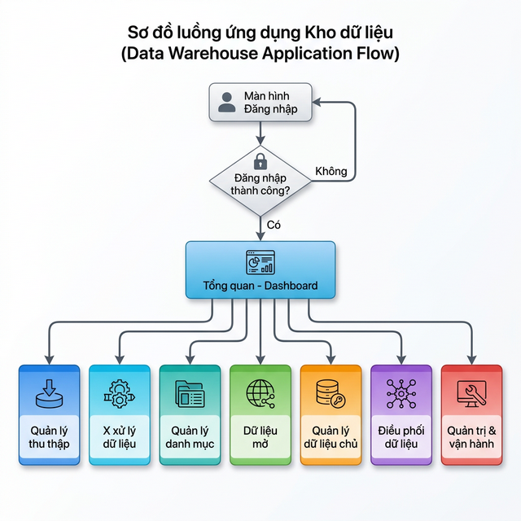

### Mã Mermaid tham chiếu:
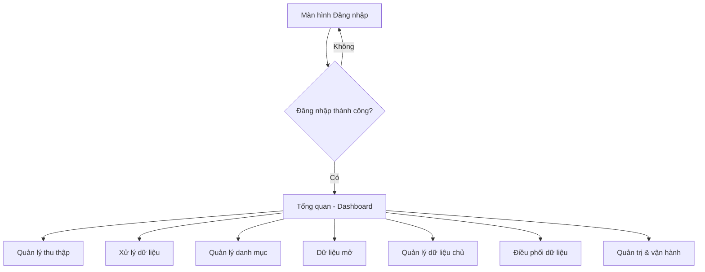

## 1. Sơ đồ Luồng dữ liệu Chi tiết (Master Data Flow)

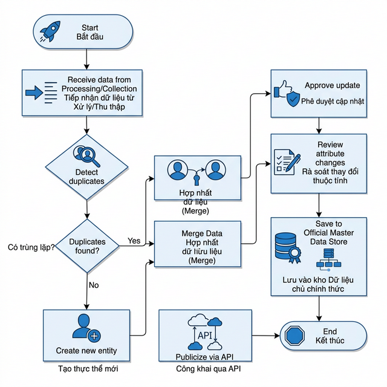

### Mã Mermaid tham chiếu:
graph TD
    subgraph "NGUỒN DỮ LIỆU (DATA SOURCES)"
        S_IN["CSDL Trong ngành (Hộ tịch, THADS, Quốc tịch...)"]
        S_OUT["CSDL Ngoài ngành (BHXH, Thuế, Dân cư...)"]
        S_FILE["Tệp tin (Excel, XML, CSV)"]
    end

    subgraph "GĐ 1: THU THẬP (INGESTION)"
        direction TB
        Ingest_Tool["Công cụ Thu thập (PM02)"]
        Ingest_Auth["Xác thực & Kết nối (API/LGSP)"]
        Raw_Store[("Kho dữ liệu thô (Raw Zone)")]
        Reconcile["Đối soát dữ liệu (Reconciliation)"]
        
        S_IN & S_OUT & S_FILE --> Ingest_Auth
        Ingest_Auth --> Ingest_Tool
        Ingest_Tool --> Raw_Store
        Ingest_Tool -.-> Reconcile
    end

    subgraph "GĐ 2: XỬ LÝ & CHUẨN HÓA (ETL/CLEANUP)"
        direction TB
        Cleanup["1. Làm sạch (Loại rác)"]
        Standard["2. Chuẩn hóa (Format/Regex)"]
        Transform["3. Biến đổi (Mapping)"]
        Error_Log["Nhật ký lỗi xử lý (Error Logs)"]
        
        Raw_Store --> Cleanup
        Cleanup --> Standard
        Standard --> Transform
        Cleanup & Standard & Transform -.-> Error_Log
    end

    subgraph "GĐ 3: DỮ LIỆU CHỦ & DANH MỤC (MASTER DATA)"
        direction TB
        Merge["Hợp nhất & Định danh duy nhất"]
        Master_Catalog[("Kho Dữ liệu chủ (Master Store)")]
        Cat_Mgmt["Quản lý Danh mục dùng chung"]
        
        Transform --> Merge
        Merge --> Master_Catalog
        Cat_Mgmt --> Master_Catalog
    end

    subgraph "GĐ 4: CUNG CẤP & ĐIỀU PHỐI (DELIVERY)"
        direction TB
        Orch["Điều phối API (Orchestration)"]
        Policy["Quản lý Chính sách & Quyền (Policy)"]
        Open_Data["Cổng Dữ liệu mở (Open Data)"]
        Monitoring["Giám sát vận hành API (Logs)"]
        
        Master_Catalog --> Orch & Open_Data
        Policy -- "Cấp quyền" --> Orch
        Orch -.-> Monitoring
    end

    subgraph "KHÁCH HÀNG / NGƯỜI DÙNG (CONSUMERS)"
        Consumer_App["Ứng dụng chuyên ngành"]
        BI_Report["Hệ thống Báo cáo & BI"]
        Public_User["Công dân & Doanh nghiệp"]
        
        Orch --> Consumer_App & BI_Report
        Open_Data --> Public_User
    end
```

## 2. Mô tả chi tiết các giai đoạn

### 2.1. Giai đoạn 1: Thu thập (Module PM02)
- **Cơ chế**: Sử dụng các Endpoint API (REST/SOAP) hoặc trục liên thông LGSP để lấy dữ liệu.
- **Đối soát**: Sau khi thu thập, hệ thống thực hiện đối soát tự động giữa "Bản ghi nguồn" và "Bản ghi kho DLDC" để đảm bảo không mất mát dữ liệu.
- **Trạng thái**: Dữ liệu ở giai đoạn này được coi là "Raw" (Thô).

### 2.2. Giai đoạn 2: Xử lý dữ liệu (Module PM04)
- **Làm sạch**: Loại bỏ các bản ghi trùng lặp thô, xử lý giá trị rỗng (Null/Empty).
- **Chuẩn hóa**: Kiểm tra định dạng (Regex) cho CCCD, Số điện thoại, Email. Chuẩn hóa ngày tháng về định dạng ISO.
- **Biến đổi**: Áp dụng các quy tắc Mapping để chuyển đổi dữ liệu từ cấu trúc nguồn sang cấu trúc chuẩn của Kho DLDC.
- **Xử lý lỗi**: Các bản ghi không vượt qua bộ lọc sẽ đẩy vào "Danh sách lỗi" để phản hồi lại hệ thống nguồn hoặc chỉnh sửa thủ công.

### 2.3. Giai đoạn 3: Quản trị Dữ liệu chủ (Module PM05)
- **Định danh**: Áp dụng quy tắc tạo mã định danh duy nhất (Unique Identifier).
- **Hợp nhất (Merge)**: Sử dụng các chiến lược (Mới nhất, Ưu tiên nguồn) để hợp nhất thông tin từ nhiều nguồn về một thực thể duy nhất (ví dụ: gộp thông tin một công dân từ CSDL Hộ tịch và CSDL Bảo hiểm).
- **Phê duyệt**: Mọi thay đổi quan trọng trong Dữ liệu chủ phải được cán bộ quản lý phê duyệt trước khi lưu vào kho chính thức.

### 2.4. Giai đoạn 4: Cung cấp & Điều phối (Module PM06 & PM08)
- **Cấp quyền (Provisioning)**: Thiết lập gói dữ liệu và giới hạn bản ghi (Rate Limit) cho từng tổ chức/đơn vị.
- **Điều phối (Orchestration)**: 
    - **API Chủ động**: Kho DLDC đẩy dữ liệu ra các hệ thống đích.
    - **API Thụ động**: Cổng dịch vụ công hoặc đơn vị ngoài gọi vào lấy dữ liệu.
- **Giám sát**: Ghi nhật ký chi tiết từng lượt gọi (Time, IP, Payload, Status) để đảm bảo an toàn thông tin.

## 3. Quản lý Vòng đời Dòng dữ liệu (Data Lifecycle)

| Thành phần | Chu kỳ | Kiểm soát chất lượng |
| :--- | :--- | :--- |
| **Dữ liệu Danh mục** | Theo phiên bản | Trạng thái: Nháp -> Chờ duyệt -> Đã công bố. |
| **Dữ liệu Nghiệp vụ** | Hàng ngày/Real-time | Đối soát (Reconciliation) 3 lớp: Nguồn - Kho - Đích. |
| **Dữ liệu Nhật ký** | Tức thời | Ghi lại mọi thao tác Thêm/Sửa/Xóa của người dùng (Audit Trail). |

---

## 4. Luồng dữ liệu chi tiết từng chức năng

> Mỗi sơ đồ bên dưới thể hiện luồng xử lý theo vai trò (swimlane) trong từng chức năng nghiệp vụ. Vai trò gồm: **Cán bộ nghiệp vụ** (thao tác hệ thống), **Hệ thống** (xử lý tự động), **Lãnh đạo/Quản lý** (phê duyệt).

---

### 4.1. GĐ 1 – THU THẬP (Module PM02)

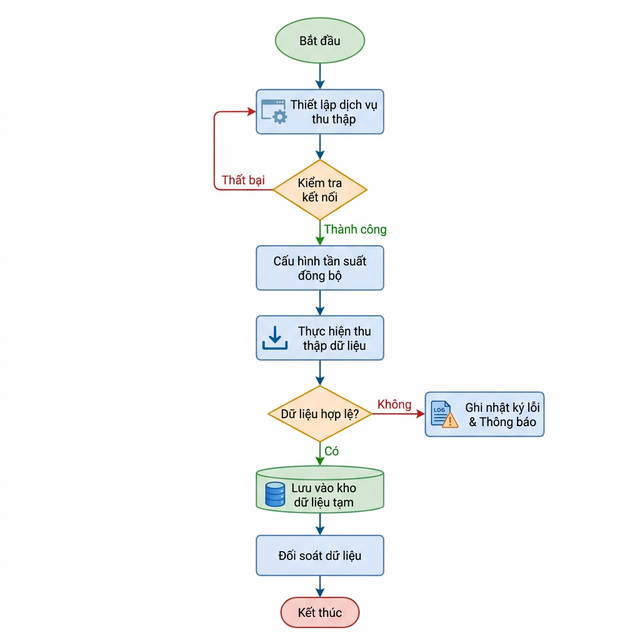

#### 4.1.1. Thiết lập dịch vụ thu thập (PM02.QLTT.TL)

##### Mã Mermaid tham chiếu:
flowchart TD
    subgraph CB ["Cán bộ nghiệp vụ"]
        A([Bắt đầu]) --> B[Mở màn hình\nDanh sách dịch vụ thu thập]
        B --> C[Nhấn 'Thêm dịch vụ mới']
        C --> D[Nhập thông tin:\nTab 1 - Thông tin chung\nTab 2 - Đơn vị cung cấp\nTab 3 - Cấu hình kết nối\nTab 4 - Cấu hình thu thập]
        D --> E[Nhấn 'Lưu nháp']
        H --> |Từ chối| I[Chỉnh sửa lại\nthông tin dịch vụ]
        I --> E
        H --> |Phê duyệt| J[Dịch vụ chuyển\ntrạng thái 'Hoạt động']
        J --> K([Kết thúc])
    end
    subgraph SYS ["Hệ thống"]
        E --> F{Kiểm tra\nhợp lệ?}
        F --> |Không hợp lệ| D
        F --> |Hợp lệ| G[Lưu cấu hình\nvào CSDL\nTrạng thái: Chờ duyệt]
        G --> H_sys[Gửi yêu cầu\nphê duyệt cho Lãnh đạo]
    end
    subgraph LD ["Lãnh đạo / Quản lý"]
        H_sys --> H{Phê duyệt?}
    end
```

#### 4.1.2. Sửa / Xóa dịch vụ thu thập (PM02.QLTT.TL)

##### Mã Mermaid tham chiếu:
flowchart TD
    subgraph CB ["Cán bộ nghiệp vụ"]
        A([Bắt đầu]) --> B[Chọn dịch vụ\ncần chỉnh sửa / xóa]
        B --> C{Thao tác?}
        C --> |Sửa| D[Mở form sửa\nchỉnh sửa các tab\nthông tin]
        D --> E[Nhấn 'Cập nhật']
        C --> |Xóa| X[Nhấn 'Xóa'\nxác nhận xóa]
    end
    subgraph SYS ["Hệ thống"]
        E --> F{Kiểm tra\nhợp lệ?}
        F --> |Không| D
        F --> |Có| G[Cập nhật bản ghi\nvào CSDL]
        G --> H[Ghi Audit Log\nThao tác: Sửa]
        X --> X2[Xóa cấu hình\nkhỏi hệ thống]
        X2 --> X3[Ghi Audit Log\nThao tác: Xóa]
        H --> Z([Kết thúc])
        X3 --> Z
    end
```

#### 4.1.3. Đối soát dữ liệu (PM02.QLTT.DS)

##### Mã Mermaid tham chiếu:
flowchart TD
    subgraph CB ["Cán bộ nghiệp vụ"]
        A([Bắt đầu]) --> B[Mở màn hình\nĐối soát dữ liệu]
        B --> C[Chọn nguồn\ncần đối soát]
        C --> D[Nhấn 'Đối soát ngay'\nhoặc chờ lịch tự động]
        G --> |Có bất thường| H[Xem danh sách\nbản ghi bất thường]
        H --> I[Nhấn 'Gửi thông báo'\ncho đơn vị nguồn]
        I --> J([Kết thúc])
        G --> |Không bất thường| J
    end
    subgraph SYS ["Hệ thống"]
        D --> E[So khớp 3 lớp:\nNguồn ↔ Kho DLDC ↔ Đích]
        E --> F[Tính tỷ lệ chính xác\nvà lưu kết quả]
        F --> G{Phát hiện\nbất thường?}
    end
    subgraph LD ["Lãnh đạo / Đơn vị"]
        I --> K[Tiếp nhận thông báo\nvà xử lý sai lệch]
    end
```

---

### 4.2. GĐ 2 – XỬ LÝ & CHUẨN HÓA (Module PM04)

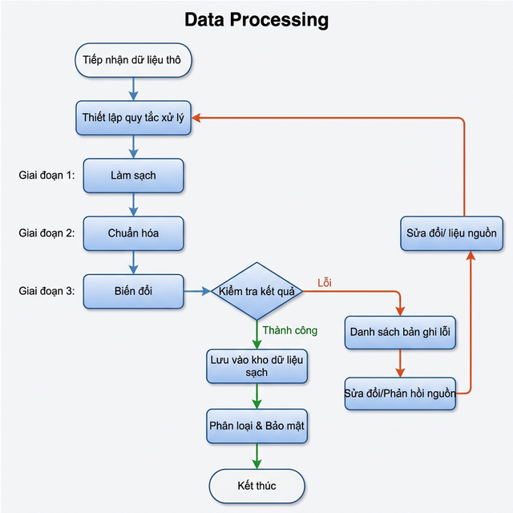

#### 4.2.1. Thiết lập & Chạy quy tắc xử lý (PM04.QLXL.QT)

##### Mã Mermaid tham chiếu:
flowchart TD
    subgraph CB ["Cán bộ nghiệp vụ"]
        A([Bắt đầu]) --> B[Mở màn hình\nDanh sách cấu hình xử lý]
        B --> C[Chọn nguồn dữ liệu\ncần cấu hình]
        C --> D[Nhấn 'Quản lý quy tắc'\ncấu hình Làm sạch\nChuẩn hóa, Biến đổi]
        D --> E[Nhấn 'Phân loại dữ liệu'\nxác định mức độ bảo mật]
        E --> F[Nhấn 'Chạy quy tắc'\nkích hoạt xử lý hàng loạt]
        I --> |Có lỗi| J[Xem 'Danh sách lỗi'\nxem xét từng bản ghi]
        J --> K[Nhấn 'Sửa đổi'\ngửi yêu cầu lại nguồn]
        I --> |Hoàn thành| L([Kết thúc])
        K --> L
    end
    subgraph SYS ["Hệ thống"]
        F --> G[Thực hiện 3 bước:\n1. Làm sạch - loại rác\n2. Chuẩn hóa - Regex\n3. Biến đổi - Mapping]
        G --> H[Ghi kết quả vào\nLịch sử xử lý]
        H --> I{Trạng thái\nkết quả?}
        I --> |Có lỗi| Err[Đẩy bản ghi lỗi\nvào Error Log]
        Err --> J
    end
```

---

### 4.3. GĐ 3a – QUẢN LÝ DANH MỤC (Module PM03)

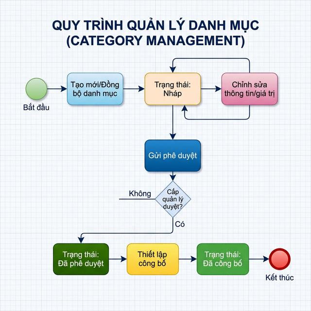

#### 4.3.1. Thiết lập danh mục (PM03.QLDM.TL)

##### Mã Mermaid tham chiếu:
flowchart TD
    subgraph CB ["Cán bộ nghiệp vụ"]
        A([Bắt đầu]) --> B[Mở màn hình\nDanh sách thiết lập danh mục]
        B --> C[Nhấn 'Thêm mới'\nnhập Mã, Tên, Loại dữ liệu]
        C --> D[Nhấn 'Lưu'\ntrạng thái: Nháp]
        D --> E{Muốn gửi\nphê duyệt?}
        E --> |Có| F[Nhấn 'Gửi phê duyệt'\nchuyển Nháp → Chờ duyệt]
        E --> |Chưa| D2[Tiếp tục chỉnh sửa\nở trạng thái Nháp]
        LD_res --> |Từ chối| G[Chỉnh sửa lại\nnội dung danh mục]
        G --> F
        LD_res --> |Phê duyệt| H[Danh mục chuyển\ntrạng thái 'Đã phê duyệt']
        H --> I([Kết thúc])
    end
    subgraph SYS ["Hệ thống"]
        F --> SYS1[Lưu trạng thái\nChờ phê duyệt]
        SYS1 --> SYS2[Gửi thông báo\ncho Lãnh đạo]
    end
    subgraph LD ["Lãnh đạo / Quản lý"]
        SYS2 --> LD_res{Phê duyệt?}
    end
```

#### 4.3.2. Công bố danh mục (PM03.QLDM.CB)

##### Mã Mermaid tham chiếu:
flowchart TD
    subgraph CB ["Cán bộ nghiệp vụ"]
        A([Bắt đầu]) --> B[Mở danh mục\nđã được phê duyệt]
        B --> C[Thiết lập:\nPhạm vi chia sẻ\nNgày công bố\nNgười thực hiện]
        C --> D[Nhấn 'Gửi phê duyệt\ncông bố']
        G --> |Từ chối| H[Điều chỉnh lại\nphạm vi hoặc ngày công bố]
        H --> D
        G --> |Đồng ý| I[Danh mục chuyển\ntrạng thái 'Đã công bố']
        I --> J[Hủy công khai\nkhi cần thiết]
        J --> K([Kết thúc])
    end
    subgraph SYS ["Hệ thống"]
        D --> E[Ghi nhận cấu hình\ncông bố vào CSDL]
        E --> F[Gửi thông báo\nphê duyệt công bố]
        I --> I2[Đẩy danh mục\nra cổng dữ liệu dùng chung]
    end
    subgraph LD ["Lãnh đạo / Quản lý"]
        F --> G{Phê duyệt\ncông bố?}
    end
```

---

### 4.4. GĐ 4 – CUNG CẤP DỮ LIỆU (Module PM08)

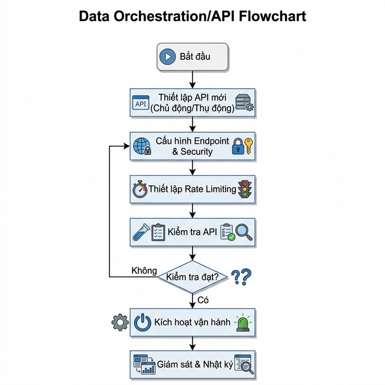

#### 4.4.1. Cấp quyền truy cập dữ liệu dùng chung (PM08.QLCC.CC)

##### Mã Mermaid tham chiếu:
flowchart TD
    subgraph CB ["Cán bộ nghiệp vụ"]
        A([Bắt đầu]) --> B[Mở màn hình\nCung cấp dữ liệu dùng chung]
        B --> C[Nhấn 'Thêm mới'\nnhập Tổ chức, Gói dữ liệu\nMức truy cập, Rate Limit\nNgày hết hạn]
        C --> D[Nhấn 'Lưu'\ngửi yêu cầu phê duyệt]
        H --> |Từ chối| I[Chỉnh sửa lại\nthông tin quyền truy cập]
        I --> D
        H --> |Phê duyệt| J[Quyền truy cập\nchuyển trạng thái 'Hoạt động']
        J --> K{Cần\nthu hồi?}
        K --> |Có| L[Nhấn 'Hủy quyền'\nthu hồi quyền truy cập]
        K --> |Không| M([Kết thúc])
    end
    subgraph SYS ["Hệ thống"]
        D --> E[Lưu cấu hình\ntrạng thái: Chờ duyệt]
        E --> F[Gửi thông báo\ncho Lãnh đạo]
        J --> J2[Cấp token / API Key\ncho tổ chức yêu cầu]
        J2 --> J3[Bắt đầu ghi Audit Log\nmỗi lần truy cập]
        L --> L2[Thu hồi token\nGhi log thu hồi]
        L2 --> M
    end
    subgraph LD ["Lãnh đạo / Quản lý"]
        F --> H{Phê duyệt?}
    end
```

#### 4.4.2. Quản lý gói tin danh mục (PM08.QLCC.DC)

##### Mã Mermaid tham chiếu:
flowchart TD
    subgraph CB ["Cán bộ nghiệp vụ"]
        A([Bắt đầu]) --> B[Mở màn hình\nDanh sách gói tin danh mục]
        B --> C{Thao tác?}
        C --> |Thêm mới| D[Nhập tên gói tin\nvà cấu trúc trường dữ liệu\nTên, Mã, Kiểu, Độ dài, Bắt buộc]
        D --> E[Nhấn 'Lưu']
        C --> |Sửa| F[Chỉnh sửa\nthông tin gói tin]
        F --> E
        C --> |Xóa| G[Xác nhận xóa\ngói tin]
        C --> |Xem trường| V[Popup xem\ndanh sách trường]
        V --> Z([Kết thúc])
    end
    subgraph SYS ["Hệ thống"]
        E --> SYS1[Lưu cấu trúc\ngói tin vào CSDL]
        SYS1 --> SYS2[Gói tin sẵn sàng\nđể áp dụng cho API]
        G --> SYS3[Xóa gói tin\nvà ghi Audit Log]
        SYS2 --> Z
        SYS3 --> Z
    end
```

---

### 4.5. Dữ liệu mở (Open Data)

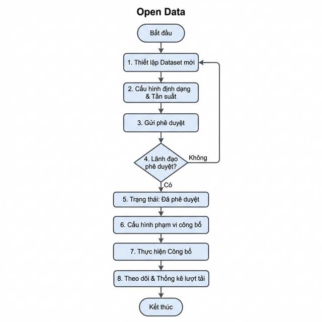

#### Mã Mermaid tham chiếu:
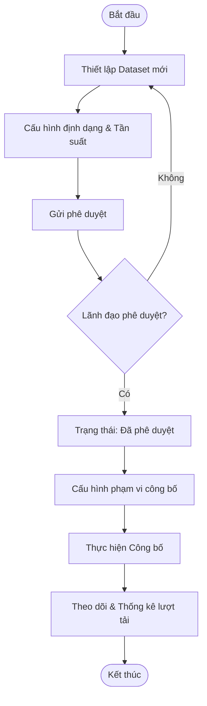

### 4.6. Quản trị & vận hành (Admin Operations)

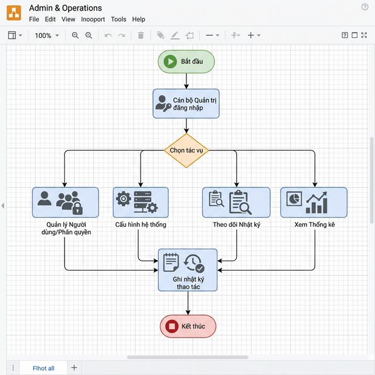

#### Mã Mermaid tham chiếu:
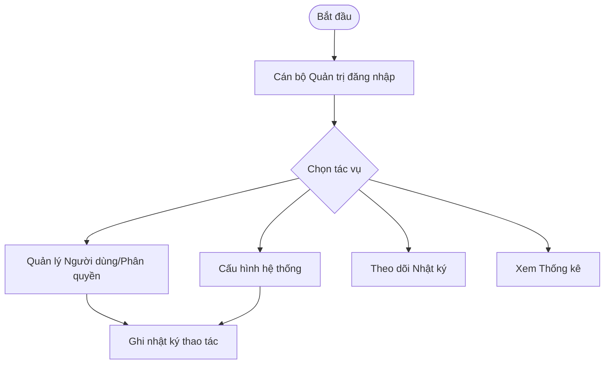

### 4.7. Tóm tắt trạng thái dữ liệu theo từng chức năng

| Giai đoạn | Chức năng | Vai trò thực hiện | Trạng thái đầu vào | Trạng thái đầu ra |
| :--- | :--- | :--- | :--- | :--- |
| **GĐ1 - Thu thập** | Thiết lập dịch vụ | Cán bộ + Lãnh đạo | - | Nháp → Chờ duyệt → Hoạt động |
| **GĐ1 - Thu thập** | Đối soát dữ liệu | Cán bộ + Hệ thống | Raw (Thô) | Đã đối soát / Có bất thường |
| **GĐ2 - Xử lý** | Chạy quy tắc | Cán bộ + Hệ thống | Raw (Thô) | Sạch / Chuẩn hóa / Lỗi |
| **GĐ3a - Danh mục** | Thiết lập danh mục | Cán bộ + Lãnh đạo | - | Nháp → Chờ duyệt → Phê duyệt |
| **GĐ3a - Danh mục** | Công bố danh mục | Cán bộ + Lãnh đạo | Đã phê duyệt | Đã công bố / Hủy công khai |
| **GĐ4 - Cung cấp** | Cấp quyền truy cập | Cán bộ + Lãnh đạo | - | Chờ duyệt → Hoạt động → Thu hồi |
| **GĐ4 - Cung cấp** | Gói tin danh mục | Cán bộ | - | Lưu → Sẵn sàng cung cấp |

---

## 5. Đối chiếu Quy trình QLTT01 – Quy trình Thu thập dữ liệu

> Tài liệu này đối chiếu quy trình nghiệp vụ **QLTT01 – Quy trình thu thập dữ liệu** (theo sơ đồ swim-lane đã phê duyệt) với hiện trạng triển khai trong phần mềm, từ đó xác định các điểm **đã đáp ứng**, **còn thiếu** và **cần bổ sung**.

### 5.1. Sơ đồ quy trình QLTT01 (tham chiếu)

Quy trình QLTT01 gồm 3 làn (swim-lane) và 7 bước chính:

| Bước | Làn thực hiện | Mô tả |
| :---: | :--- | :--- |
| 1 | **Quản trị kho DLDC** | Thiết lập thu thập (cấu hình nguồn, phương thức kết nối, tần suất) |
| 2 | **Hệ thống nguồn** | Gửi dữ liệu sang Kho DLDC |
| 3 | **Hệ thống kho DLDC** | Tiếp nhận dữ liệu (nhận gói dữ liệu từ nguồn) |
| 4 | **Hệ thống kho DLDC** | Kiểm tra dữ liệu (định dạng, cấu trúc, ràng buộc...) |
| 5a | **Hệ thống kho DLDC** | *(Không đạt)* → Gửi thông báo lỗi cho hệ thống nguồn |
| 5b | **Hệ thống kho DLDC** | *(Đạt yêu cầu)* → Gửi thông báo nhận thành công |
| 6 | **Hệ thống nguồn** | Tiếp nhận phản hồi (lỗi hoặc xác nhận thành công) |

---

### 5.2. Đánh giá từng bước – Hiện trạng phần mềm

#### ✅ Bước 1 – Thiết lập thu thập (Đã đáp ứng đầy đủ)

Phần mềm đã có màn hình **Thêm mới dịch vụ thu thập** (`AddDataCollectionForm`) với đầy đủ các trường:
- Loại nguồn (Bộ ngoài / Nội bộ)
- Cơ quan nguồn, Loại dữ liệu, Tên dữ liệu
- Tần suất thu thập (Hằng ngày / Hằng tuần / Hằng tháng...)
- Định dạng (JSON / XML / CSV / Excel)
- Thông tin kết nối: Phương thức (API / FTP / SFTP), Endpoint, Auth (API Key / Username-Password), Port

UC **Quản lý phương thức thu thập dữ liệu** chỉ yêu cầu các thao tác CRUD (Thêm mới, Cập nhật, Xóa, Xem chi tiết, Tra cứu, Kết xuất) — **không có yêu cầu phê duyệt**. Phần mềm đã đáp ứng đầy đủ.

---

#### ✅ Bước 2 – Hệ thống nguồn gửi dữ liệu (Đã có cơ sở)

Phần mềm hỗ trợ tiếp nhận dữ liệu qua nhiều phương thức (API REST, Upload File, SFTP) thể hiện trong `DataCollectionList` (nhật ký hoạt động). Tuy nhiên phần mềm là **Kho DLDC nên không trực tiếp kiểm soát hành vi "gửi" của hệ thống nguồn** – đây là bước bên ngoài hệ thống.

---

#### ✅ Bước 3 – Tiếp nhận dữ liệu (Đã đáp ứng)

Module `ReceiveDataPanel` đã triển khai đầy đủ:
- Hàng đợi tiếp nhận (Receiving Queue) hiển thị từng gói dữ liệu đến
- Thông tin: Mã giao dịch, nguồn, thời gian tiếp nhận, loại dữ liệu, định dạng, số bản ghi, dung lượng
- Trạng thái tiếp nhận: **Đang tiếp nhận** / **Đã tiếp nhận**
- Nhật ký tiếp nhận (Receive Log)

---

#### ✅ Bước 4 – Kiểm tra dữ liệu (Đã đáp ứng phần lớn)

Module `ReceiveDataPanel` có phần **Kiểm soát chất lượng** sau khi tiếp nhận:
- Số bản ghi **Hợp lệ / Lỗi / Cảnh báo**
- Chi tiết lỗi: mã bản ghi, trường lỗi, loại lỗi (Thiếu dữ liệu, Định dạng sai...), mô tả
- Nút **"Kiểm tra ngay"** để kích hoạt kiểm tra thủ công

> **Còn thiếu:** Kiểm tra hiện tại chủ yếu là **kiểm tra thủ công** (nhấn nút). Quy trình QLTT01 kỳ vọng kiểm tra **tự động ngay khi tiếp nhận** (auto-validation). Cần bổ sung cơ chế tự động chạy kiểm tra định dạng & cấu trúc ngay sau khi gói dữ liệu được nhận.

---

#### ✅ Bước 5a – Gửi thông báo lỗi (Đã đáp ứng cơ bản)

Trong `ReceiveDataPanel`, khi có lỗi hệ thống đã ghi nhận **Danh sách thông báo** (`notificationList`) đã gửi cho đơn vị nguồn, bao gồm: ngày gửi, người nhận, tiêu đề, trạng thái.

> **Còn thiếu:** **Gửi thông báo tự động** khi phát hiện lỗi. Hiện tại, thông báo được ghi nhận nhưng chưa có cơ chế **tự động kích hoạt gửi email/notification** đến hệ thống nguồn ngay khi kiểm tra phát hiện vi phạm.

---

#### ✅ Bước 5b – Gửi thông báo nhận thành công (Đã đáp ứng cơ bản)

Khi dữ liệu hợp lệ 100% (ví dụ: `TXN-2025120701236` – Hồ sơ quốc tịch: passed=456, failed=0), hệ thống ghi nhận hoàn tất. Nhật ký tiếp nhận hiển thị "Tiếp nhận thành công".

> **Còn thiếu:** Chưa có cơ chế **gửi xác nhận chủ động (ACK/Response)** về hệ thống nguồn khi tiếp nhận thành công. Hiện trạng chỉ ghi log nội bộ, chưa có API callback thông báo ngược lại.

---

#### ✅ Bước 6 – Hệ thống nguồn tiếp nhận phản hồi (Đã có tracking)

`ReceiveDataPanel` có cột **Phản hồi** trong phần kiểm soát chất lượng, thể hiện tỷ lệ `responsesReceived/responsesTotal`. Danh sách phản hồi (`responseList`) ghi nhận nội dung phản hồi từ đơn vị nguồn.

> **Còn thiếu:** Chưa có màn hình **quản lý vòng đời phản hồi** riêng biệt. Khi đơn vị nguồn đã sửa lỗi và gửi lại dữ liệu, hệ thống chưa có cơ chế tự động liên kết gói dữ liệu mới với yêu cầu sửa lỗi ban đầu (re-submission tracking).

---

### 5.3. Tóm tắt – Mức độ đáp ứng

| Bước QLTT01 | Mô tả | Mức đáp ứng | Ghi chú |
| :---: | :--- | :---: | :--- |
| **Bước 1** | Thiết lập thu thập | ✅ Đầy đủ | UC không yêu cầu phê duyệt; CRUD đã đáp ứng hoàn toàn |
| **Bước 2** | Hệ thống nguồn gửi dữ liệu | ✅ Ngoài phạm vi PM | Bên ngoài hệ thống, chỉ cần hỗ trợ tiếp nhận |
| **Bước 3** | Tiếp nhận dữ liệu | ✅ Đầy đủ | Hàng đợi, log tiếp nhận hoạt động tốt |
| **Bước 4** | Kiểm tra định dạng, cấu trúc | ⚠️ Một phần | Kiểm tra thủ công; thiếu auto-validation sau tiếp nhận |
| **Bước 5a** | Gửi thông báo lỗi | ⚠️ Một phần | Ghi nhận thông báo nhưng thiếu gửi tự động |
| **Bước 5b** | Gửi thông báo thành công | ⚠️ Một phần | Ghi log nội bộ; thiếu ACK callback về nguồn |
| **Bước 6** | Tiếp nhận phản hồi từ nguồn | ⚠️ Một phần | Có tracking nhưng thiếu re-submission linking |

**Chú thích:** ✅ Đầy đủ &nbsp;|&nbsp; ⚠️ Một phần (có nhưng chưa hoàn chỉnh) &nbsp;|&nbsp; ❌ Chưa có

---

### 5.4. Các hạng mục cần bổ sung / phát triển

| STT | Hạng mục bổ sung | Ưu tiên | Mô tả |
| :---: | :--- | :---: | :--- |
| 1 | **Auto-validation sau tiếp nhận** | 🔴 Cao | Tự động chạy kiểm tra định dạng, cấu trúc, bắt buộc ngay sau khi gói dữ liệu được tiếp nhận, không cần người dùng nhấn "Kiểm tra ngay". |
| 2 | **Gửi thông báo lỗi tự động** | 🟡 Trung bình | Khi auto-validation phát hiện lỗi, hệ thống tự động gửi email/notification đến đầu mối kỹ thuật của đơn vị nguồn với danh sách lỗi chi tiết. |
| 3 | **ACK callback – Xác nhận nhận thành công** | 🟡 Trung bình | Khi dữ liệu qua kiểm tra 100%, hệ thống tự động gọi callback API (hoặc gửi email) xác nhận về hệ thống nguồn với mã giao dịch và số bản ghi hợp lệ. |
| 4 | **Re-submission tracking** | 🟡 Trung bình | Cơ chế liên kết gói dữ liệu gửi lại (sau khi nguồn đã sửa lỗi) với yêu cầu sửa lỗi ban đầu. Hiển thị lịch sử các lần gửi của cùng một nguồn/loại dữ liệu. |
| 5 | **Màn hình quản lý phản hồi vòng đời** | 🟢 Thấp | Màn hình riêng thể hiện đầy đủ vòng đời: Gửi thông báo lỗi → Nhận phản hồi → Xác nhận đã xử lý → Đóng ticket. |
