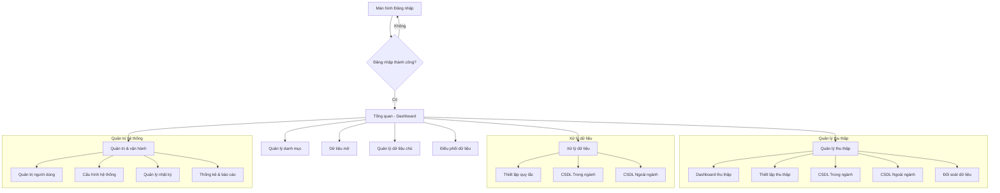

# 4.1. PM01.TQ - TỔNG QUAN (DASHBOARD)

## 4.1.1. PM01.TQ.DB – Dashboard tổng quan

### *4.1.1.1. Mục đích*
Cung cấp một cái nhìn toàn cảnh, tập trung về hiệu năng và tình trạng hoạt động của toàn bộ hệ thống Kho DLDC. Màn hình này giúp lãnh đạo và cán bộ quản trị nhanh chóng nắm bắt các chỉ số KPI quan trọng, theo dõi xu hướng và phát hiện các vấn đề cần chú ý thông qua các biểu đồ trực quan.

### 4.1.1.2. PM01.TQ.DB.MH01 – Màn hình Tổng quan hệ thống

#### 4.1.1.2.1. MH01 Màn hình Tổng quan hệ thống
##### Màn hình
- Màn hình:

Hình 1 - Màn hình Dashboard Tổng quan hệ thống

##### Mô tả thông tin trên màn hình

**A. Nhóm chỉ số chính (KPI Cards)**
Hiển thị các con số quan trọng nhất của hệ thống. Người dùng có thể nhấn vào từng thẻ để xem chi tiết.
| Chỉ số | Mô tả | Chi tiết hiển thị |
| :--- | :--- | :--- |
| **Thu thập** | Tổng số bản ghi đã được thu về kho. | Số lượng bản ghi tăng thêm trong tháng. |
| **Xử lý** | Số lượng bản ghi đã qua quy trình làm sạch/chuẩn hóa. | Tỷ lệ hoàn thành xử lý (%). |
| **Chia sẻ** | Tổng lượt truy xuất và cung cấp dữ liệu. | Số lượt phát sinh trong tuần. |

**B. Hệ thống biểu đồ thống kê**
| Tên biểu đồ | Loại | Mô tả |
| :--- | :--- | :--- |
| **Xu hướng Thu thập** | Line Chart | Theo dõi lượng dữ liệu thu thập trong 7 ngày gần nhất. |
| **Quy trình Xử lý** | Bar Chart | Thống kê số lượng theo giai đoạn: Làm sạch -> Chuẩn hóa -> Biến đổi. |
| **Phương thức Chia sẻ** | Pie Chart | Tỷ lệ chia sẻ qua: API, Export file, Đồng bộ hệ thống. |
| **Top 5 Dịch vụ** | Mixed Bar | 5 dịch vụ có lượt chia sẻ cao nhất (Phân loại Trong/Ngoài ngành). |
| **Xu hướng Dữ liệu chủ**| Area Chart | Biểu đồ tăng trưởng của kho dữ liệu gốc trong 6 tháng. |
| **Danh mục dùng chung** | Horiz. Bar | Thống kê số lượng danh mục (Giới tính, Dân tộc, Đơn vị hành chính...). |
| **Dữ liệu mở** | Stacked Bar | Tỷ lệ dữ liệu đã công bố và đang chờ phê duyệt theo lĩnh vực. |

##### Chức năng trên màn hình
| STT | Mã chức năng | Định dạng | Mô tả |
| :--- | :--- | :--- | :--- |
| 1 | CN01 | Click | Nhấn vào một thẻ KPI để mở popup chi tiết (MH01.P01). |
| 2 | CN02 | Hover | Di chuột qua các cột/phần của biểu đồ để xem số liệu chi tiết. |
| 3 | CN03 | Dropdown | Lọc dữ liệu trên toàn bộ dashboard theo khoảng thời gian (7 ngày, 30 ngày...). |

#### 4.1.1.2.2. MH01.P01 – Chi tiết chỉ số (Popup)
##### Màn hình
- Màn hình: (Popup hiển thị danh sách chi tiết)

##### Mô tả thông tin trên màn hình
Hiển thị khi người dùng nhấn vào các thẻ KPI (Thu thập, Xử lý, Chia sẻ).
| Trường thông tin | Kiểu dữ liệu | Bắt buộc | Mặc định | Mô tả |
| :--- | :--- | :--- | :--- | :--- |
| Tên dữ liệu | VARCHAR2(255) | - | - | Tên CSDL hoặc dịch vụ cụ thể. |
| Nguồn | VARCHAR2(255) | - | - | Hệ thống hoặc đơn vị cung cấp dữ liệu. |
| Số lượng đồng bộ | NUMBER | - | - | Tổng số bản ghi đã ghi nhận. |
| Lần đồng bộ cuối | DATE | - | - | Thời điểm cập nhật dữ liệu gần nhất. |
| Trạng thái | VARCHAR2(50) | - | - | Thành công, Cảnh báo hoặc Lỗi. |

##### Chức năng trên màn hình
| STT | Mã chức năng | Định dạng | Mô tả |
| :--- | :--- | :--- | :--- |
| 1 | CN01 | Button text | Đóng popup. |

## 4.1.2. Luồng ứng dụng tổng quan

### *4.1.2.1. Sơ đồ luồng ứng dụng*
Sơ đồ dưới đây thể hiện luồng điều hướng chính của người dùng sau khi đăng nhập vào hệ thống:

---
*Tài liệu này cung cấp cái nhìn tổng thể. Chi tiết về từng phân hệ vui lòng tham khảo các tệp tin phân tích tương ứng.*
